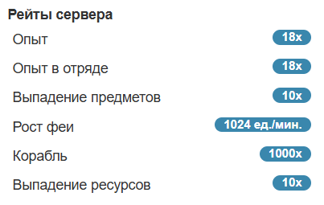
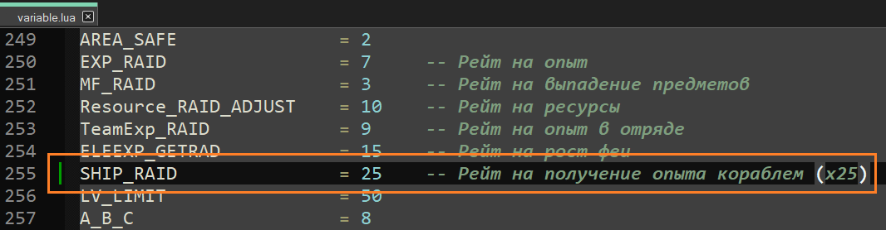
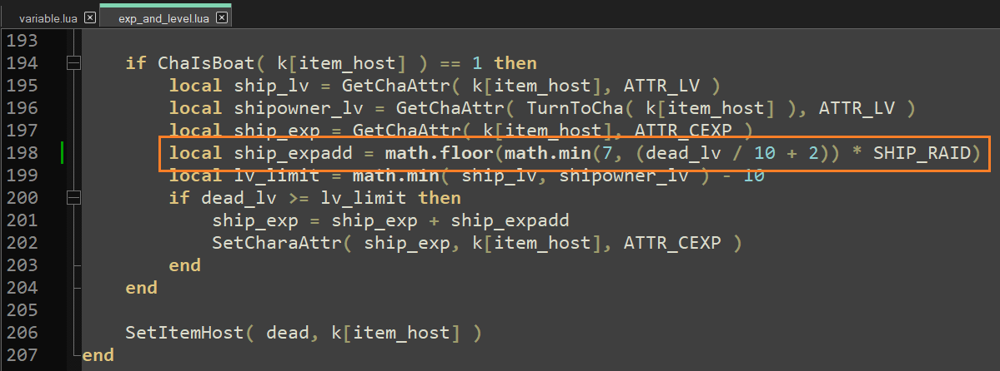

# Изменение рейтов сервера



Привет!

В данном пособии поговорим про изменение рейтов вашего сервера.

---

Рейты (множители) — это некоторые коэффициенты, которые определяют скорость развития персонажей игроков в частности и экономики сервера в целом. Чем выше рейты (> 1.0) — тем быстрее игроки "прокачивают" своих персонажей, добывают ценный лут и ресурсы, выращивают фей. И наоборот, чем ниже рейты (< 1.0), тем сильнее замедляется игра.

Всего у сервера Пиратии 5 рейтов — `опыт в одиночку`, `опыт в отряде`, `шанс выпадения предметов`, `шанс выпадения ресурсов` и `скорость роста феи`. Дополнительно, можно добавить рейт на `скорость развития корабля`, но это потребует небольшой модификации Lua-скриптов сервера.

Итак, рассмотрим каким образом можно изменить данные рейты.

## Опыт, шанс выпадения предметов и ресурсов, фея.

Откройте файл `GameServer\resource\script\calculate\variable.lua` в любом текстовом редакторе (Блокнот, Notepad++, Visual Studio Code), найдите соответствующую переменную из таблицы ниже и измените её значение (после знака "=") на требуемое, больше нуля:
| №      | Переменная | Рейт | Значение по умолчанию | Примечание |
| ----------- | ----------- | ----------- | ----------- | ----------- |
| 1. | Опыт в одиночку | EXP_RAID | 1 | - |
| 2. | Опыт в отряде | TeamExp_RAID | 1 | - |
| 3. | Выпадение предметов | MF_RAID | 1 | - |
| 4. | Выпадение ресурсов | Resource_RAID_ADJUST | 1 | - |
| 5. | Рост феи | ELEEXP_GETRAD | 1 | д.б. > 1.0, единицы в минуту|

Например:
```
EXP_RAID              = 7     -- Рейт на опыт
MF_RAID               = 3     -- Рейт на выпадение предметов
Resource_RAID_ADJUST  = 10    -- Рейт на ресурсы
TeamExp_RAID          = 9     -- Рейт на опыт в отряде
ELEEXP_GETRAD         = 15    -- Рейт на рост феи
```

В данном примере получим следующие значения рейтов:
- Опыт: x7;
- Опыт в отряде: x9;
- Выпадение предметов: x3;
- Выпадение ресурсов: x10;
- Рост феи: x15.

## Добавляем рейт на корабль.

Данный рейт может понадобиться в случае, если вы хотите ускорить или замедлить получение опыта кораблями игроков.
1) Откройте файл `GameServer\resource\script\calculate\variable.lua` в любом текстовом редакторе, добавьте в него переменную `SHIP_RAID` и присвоейте её требуемое значение рейта:
    ```
    SHIP_RAID = 25 -- Рейт на получение опыта кораблем (x25)
    ```
    Данную строку удобно добавить неподалеку от переменных, описыващих остальные рейты:
    
    Сохраните файл `variable.lua` после внесения изменений;
2) Откройте файл `GameServer\resource\script\calculate\exp_and_level.lua` в любом текстовом редакторе, найдите следующую строку (ищите по названию переменной `ship_expadd` — число пробелов в строке может отличаться):
    ```
    local ship_expadd = math.floor(math.min(7, (dead_lv / 10 + 2)))
    ```
    ... и замените её на новую строку:
    ```
    local ship_expadd = math.floor(math.min(7, (dead_lv / 10 + 2)) * SHIP_RAID)
    ```
    
    Сохраните файл `exp_and_level.lua` после внесения изменений.
3) Теперь вы можете задавать скорость получения опыта кораблями игроков изменяя значение переменной `SHIP_RAID` в файле `variable.lua`!

## Применение новых рейтов

После того как вы отредактировали файл `variable.lua`, чтобы новые рейты вступили в силу, необходимо перезагрузить все экземпляры GameServer.exe, то есть перезапустить сервер. Конечно, это замечание справедливо только в том случае, если вы изменяли рейты при работающем сервере.

Есть способ изменения рейтов без перезапуска сервера. Для этого можно воспользоваться GM-командой `&lua_all`, в общем виде она выглядит следующим образом:
```
&lua_all [Рейт]=[Значение]
```
Например:
```
&lua_all EXP_RAID=50
```
После вызова такой команды, рейты на опыт персонажей изменятся на x50 для всех экземпляров GameServer.exe.

Применение команды `&lua_all` не отменяет редактирование рейтов в файле `variable.lua`, поскольку при последующем перезапуске экземпляров GameServer.exe значения рейтов откатятся на прежние значения из файла (если вызов команды заведомо не носит временный характер).

---

Пишите в комментариях, если у вас остались вопросы по процессу изменения рейтов сервера или есть замечания!

Благодарю за внимание!