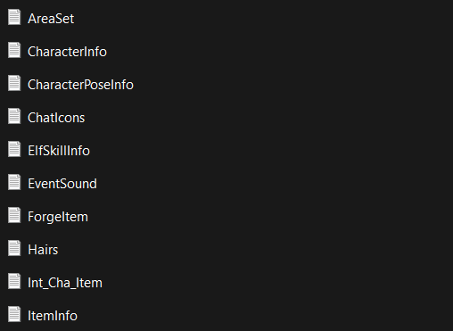
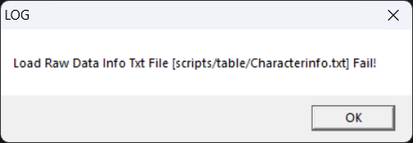
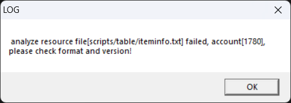
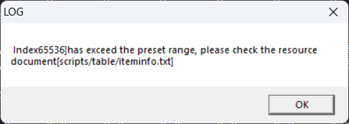

# Компиляция .txt таблиц



В геймплее Пиратии присутствует множество объектов и игровых сущностей: персонажи, монстры, NPC, предметы, корабли, самоцветы, прически, звуки и музыка, анимации и различные эффекты, и многие другие.

Информация (параметры, характеристики, атрибуты, свойства) и метаданные об этих объектах в своем большинстве записаны в специальных двоичных файлах в формате **.bin**. Например, `ItemInfo.bin` или `CharacterInfo.bin`.

Данные файлы присутствуют как в клиенте (папка `Пиратия Online\scripts\table`), так и на стороне сервера (папка `GameServer\resource`). Клиент и сервер загружают их в свою память при запуске, после чего на основании информации из них создаются игровые сущности. Большая часть .bin файлов одинакова для клиента и сервера, так, например, и клиент, и сервер используют файл `ItemInfo.bin`. Но есть .bin файлы, которые характерны только для одной стороны. К примеру, файл `SceneObjInfo.bin` присутствует только в клиенте (в файле описываются 3D-объекты, расположенные на игровой сцене, по которой перемещаются персонажи — серверу эта информация для работы не нужна), а файл `Character_Lvup.bin` используется только сервером (сопоставление уровней персонажей и необходимого числа очков опыта — все вычисления должны производиться на стороне сервера).

**.bin** файлы получаются из соответствующих текстовых **.txt** файлов путем процесса, который в Сообществе принято называть "*Компиляцией .txt таблиц*", или просто "*Компиляцией*". Дело в том, что в исходном виде все объекты описываются с помощью обычного текста. В общем случае .txt файлы представляют собой последовательности строк, содержащие поля, разделенные символом табуляции ("табами") — отсюда "таблицы". Таким образом, их очень легко редактировать с помощью любого текстового редактора.
```
Поле [1][1]     Поле [1][2]    ...    Поле [1][N]

...

Поле [M][1]     Поле [M][2]    ...    Поле [M][N]
```

Соответственно, если вы хотите, скажем, добавить новый предмет, то вам нужно определенным образом отредактировать исходный файл ItemInfo.txt и получить из него файл ItemInfo.bin, который далее будет использоваться клиентом и сервером.

**Проблема:** Сервер автоматически "компилирует" .bin файлы из .txt файлов, для этого достаточно поместить .txt файлы в директорию `GameServer\resource`. Клиент автоматически не преобразует .txt файлы в формат .bin.

В данном пособии будет описан процесс подготовки .bin файлов для клиента.

---

 1) С помощью любого текстового редактора (Блокнот, Notepad++, Visual Studio Code) создайте пакетный файл (например, compile.bat) в корневой папке игрового клиента (`Пиратия Online`) со следующим содержимым:
    ```
    start system\Game.exe startgame table_bin
    ```
2) Поместите необходимые для преобразования в .bin текстовые .txt файлы в директорию `Пиратия Online\scripts\table`;
3) Запустите пакетный файл, созданный на `шаге (1)`. Начнется процесс "компиляции" ВСЕХ .bin файлов, которые требуются для работы клиента. В процессе "компиляции" на экране могут появляться сообщения об ошибках. Ошибки могут быть трех типов:
    + Клиент не может найти исходный .txt файл для преобразования в .bin файл. Если вы на `шаге (2)` не поместили этот .txt файл в директорию `Пиратия Online\scripts\table` за отсутствием необходимости, то просто проигнорируйте данную ошибку. В противном случае проверьте соответствующие пути и файлы:
    
    + Исходный .txt файл содержит синтаксические ошибки — приведите .txt файл в соответствие с его табличным форматом (проверьте число полей у строк, корректность расстановки знаков табуляции и переноса строк, значения полей):
    
    + Исходный .txt файл содержит число строк, превышающее некоторый лимит. Например, по умолчанию в ItemInfo.txt (ItemInfo.bin) может быть записано только 6000 строк (предметов), а в CharacterInfo.txt (CharacterInfo.bin) только 1200 строк (монстров). Для исправления ошибки удалите лишние строки в исходном .txt файле. Если лишних строк нет, то необходимо увеличить лимиты путем модификации исполняемого файла клиента (Game.exe) и сервера (GameServer.exe) — это предмет обсуждения для отдельной статьи:
    
4) В случае отсутствия ошибок, в папке `Пиратия Online\scripts\table` появятся новые .bin файлы.

---

Если у вас остались вопросы или появились замечения по процессу "компиляции" .txt таблиц, то пишите в комментариях!

Благодарю за внимание!