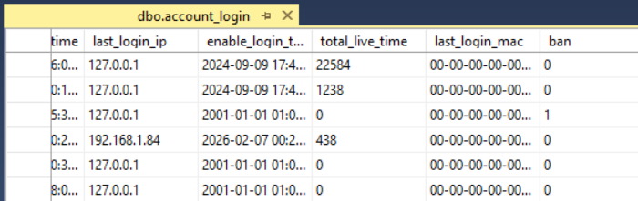
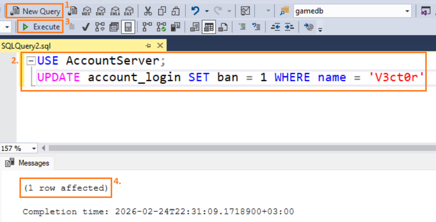
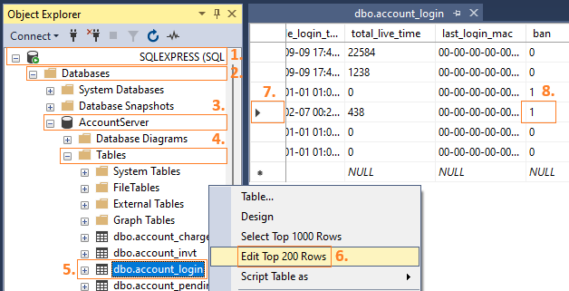

# Приемы администрирования: Как заблокировать (разблокировать) аккаунт

Всем привет!

К сожалению, иногда возникает необходимость бана игроков, например, из-за нарушения ими правил вашего сервера — в таком случае нужно временно либо постоянно ограничить нарушителям доступ к игре.

Вследствие этого в данной заметке будут рассмотрены некоторые способы блокировки и разблокировки игровых аккаунтов, которые вы сможете применять как администратор.

Информация об игровых аккаунтах хранится в таблице `account_login` базы данных `AccountServer`. У таблицы `account_login` есть поле `ban`, которое принимает два значения — `0` или `1`. При значении поля `ban`, равном `0`, соответствующий аккаунт не заблокирован, и игрок может его использовать для входа в игру. Значение `1`, напротив, помечает аккаунт как заблокированный, т. е. недоступный для входа в игру.



Итак, чтобы заблокировать игровой аккаунт, необходимо найти соответствующую запись в таблице `account_login` базы данных `AccountServer` (например, по логину, имени персонажа, IP-адресу или MAC-адресу нарушителя) и выставить её поле `ban` в значение `1`. И обратное действие, чтобы разблокировать аккаунт, нужно выставить поле `ban` в значение `0`.

Отметим несколько особенностей:
1. После установки поля `ban` в значение `1` аккаунт блокируется навсегда. Если блокировка должна носить временный характер, то вам нужно вручную через требуемое время вернуть значение `0` либо использовать автоматизированные скрипты по таймеру;
2. Если в момент блокировки игрок находится в игре, то он не будет кикнут и сможет продолжать игру до тех пор, пока не отключится от сервера (выйдет из аккаунта);
3. Помните, что после блокировки игрок может создать новый аккаунт и продолжать нарушать правила вашего сервера. Таким образом, блокировка аккаунта не является полноценной мерой пресечения нарушений и защиты сервера;
4. В случае блокировки аккаунтов по IP- или MAC-адресу игроки могут относительно легко изменять свои соответствующие адреса.

Далее приведем ряд SQL-запросов для блокировки (разблокировки) аккаунтов игроков:

1. По названию аккаунта (логину):

    Блокировка:

    ```
    USE AccountServer;
    UPDATE account_login SET ban = 1 WHERE name = 'Логин';
    ```

    Разблокировка:

    ```
    USE AccountServer;
    UPDATE account_login SET ban = 0 WHERE name = 'Логин';
    ```

2. По имени (нику) персонажа:

    Блокировка:

    ```
    UPDATE AccountServer.dbo.account_login
    SET ban = 1
    WHERE name COLLATE Chinese_PRC_CI_AS IN (
        SELECT DISTINCT GameDB.dbo.account.act_name
        FROM GameDB.dbo.character
        JOIN GameDB.dbo.account
            ON CHARINDEX(
                ';' + CAST(GameDB.dbo.character.cha_id AS VARCHAR(10)) + ';' COLLATE Chinese_PRC_CI_AS ,
                ';' + GameDB.dbo.account.cha_ids + ';'
            ) > 0
        WHERE GameDB.dbo.character.cha_name = 'Имя персонажа'
    );
    ```
 
    Разблокировка:

    ```
    UPDATE AccountServer.dbo.account_login
    SET ban = 0
    WHERE name COLLATE Chinese_PRC_CI_AS IN (
        SELECT DISTINCT GameDB.dbo.account.act_name
        FROM GameDB.dbo.character
        JOIN GameDB.dbo.account
            ON CHARINDEX(
                ';' + CAST(GameDB.dbo.character.cha_id AS VARCHAR(10)) + ';' COLLATE Chinese_PRC_CI_AS ,
                ';' + GameDB.dbo.account.cha_ids + ';'
            ) > 0
        WHERE GameDB.dbo.character.cha_name = 'Имя персонажа'
    );
    ```

3. По IP-адресу:

    Блокировка:

    ```
    USE AccountServer;
    UPDATE account_login SET ban = 1 WHERE last_login_ip = 'IP-адрес';
    ```

    Разблокировка:

    ```
    USE AccountServer;
    UPDATE account_login SET ban = 0 WHERE last_login_ip = 'IP-адрес';
    ```

4. По MAC-адресу (в формате `XX-XX-XX-XX-XX-XX-XX-XX`, где XX — шестнадцатеричные разряды):

    Блокировка:

    ```
    USE AccountServer;
    UPDATE account_login SET ban = 1 WHERE last_login_mac = 'MAC-адрес';
    ```

    Разблокировка:

     ```
    USE AccountServer;
    UPDATE account_login SET ban = 0 WHERE last_login_mac = 'MAC-адрес';
    ```

**Внимание!** Способы **(3)** и **(4)** могут заблокировать (разблокировать) сразу несколько аккаунтов, поэтому используйте их с осторожностью и предельным вниманием.

---

Закрепим полученные знания на практике и заблокируем аккаунт с логином `V3ct0r`.

1. Запустите программу **Microsoft SQL Server Management Studio** и подключитесь к вашему MSSQL-серверу, указав его адрес и пару логин/пароль для пользователя базы данных AccountServer (при соответствующем типе аутентификации);

2. **Способ 1**. Выполняем SQL-запрос.

    

    2.1 Создайте новый запрос (кнопка "**New Query**" ("Новый запрос") (**1**) или сочетание клавиш "**Ctrl + N**") и в многострочном поле редактирования SQL-запроса (**2**) введите следующий SQL-запрос:

    ```
    USE AccountServer;
    UPDATE account_login SET ban = 1 WHERE name = 'V3ct0r'
    ```

    2.2 Выполните SQL-запрос (кнопка "**Execute**" ("Выполнить") (**3**) или клавиша **F5**). При успешном результате выполнения SQL-запроса в поле "**Messages**" ("Сообщения") должно появиться сообщение вида: `(1 row affected)` (**4**), то есть был заблокирован 1 аккаунт. Сообщение `(0 row affected)` означает что аккаунт, который нужно заблокировать, не найден — проверьте правильность написания логина, имени персонажа, IP-адреса или MAC-адреса в WHERE-части SQL-запроса. Иные сообщения означают ошибки выполнения SQL-запроса и обычно содержат информацию, которая поможет его скорректировать.

3. **Способ 2**. Используем графический интерфейс пользователя программы Microsoft SQL Management Studio.

    

    3.1 В окне "**Object Explorer**" ("Обзор объектов") (**1**) найдите дерево "**Databases**" ("Базы данных") (**2**), а в нем — базу данных **AccountServer** (**3**);
 
    3.2 Раскройте дерево базы данных **AccountServer**, найдите поддерево "**Tables**" ("Таблицы") (**4**), а в нем — таблицу **account_login** (**5**). Кликните по таблице правой кнопкой мыши и в контекстном меню выберите пункт "**Edit Top 200 Rows**" ("Редактировать первые 200 строк") (**6**);

    3.3 Появится окно редактирования данных в таблице **account_login**. По полю **name** (**7**) найдите строку аккаунта, который необходимо заблокировать (в нашем примере — **V3ct0r**);

    3.4 Кликните по полю **ban** найденной в предыдущем пункте строке. Появится поле ввода текста (**8**) — впишите в него значение **1** и нажмите клавишу **Enter**. Аккаунт будет заблокирован.

4. Для разблокировки аккаунта используйте **Способ 1** или **Способ 2**, но присваивайте полю **ban** значение **0**.

**Примечание**: При большом числе аккаунтов в базе данных AccountServer предпочтительнее использовать **Способ 1**.

---

Друзья, благодарю за внимание!

Если у вас остались какие-либо вопросы, то пишите их в комментариях к данной заметке!