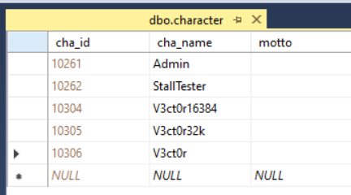
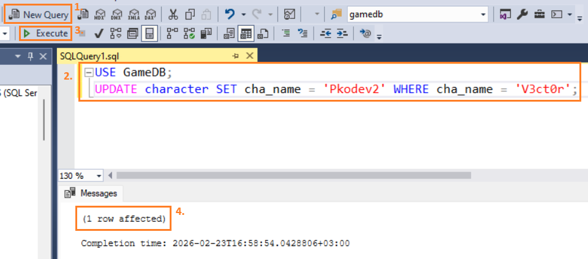
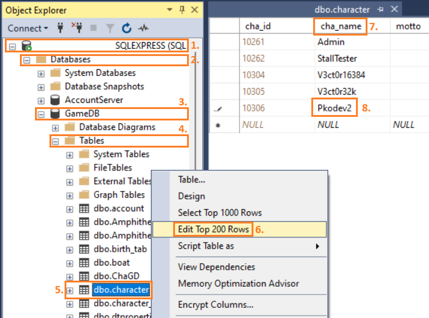

# Приемы администрирования: Как сменить имя персонажа

Друзья, привет!

В этой заметке узнаем, как переименовывать персонажей. Например, по просьбе игроков, в случае если кто-то из них решил поменять свой ник или указал его по ошибке.

Информация из заметки также поможет вам разрабатывать сервисы по автоматизированной смене имен персонажей!

Вся информация о персонажах игроков, в том числе их имена, хранится в таблице `character` базы данных `GameDB` — у данной таблицы есть поле `cha_name`, в которое как раз записываются имена персонажей: 



Имя персонажа должно соответствовать ряду условий:
1. Имя персонажа не может быть пустым;
2. В имени персонажа должны использоваться только буквы и цифры;
3. Максимальная длина имени персонажа должна быть не более 15 сивмолов;
4. Регистр букв имеет значение, например, **Pkodev2** и  **pkodev2** — это два разных персонажа;
5. Имена персонажей должны быть уникальными — не может быть двух персонажей с одинаковыми именами.

SQL-запрос на смену имени персонажа в общем виде выглядит следующим образом:

```
USE GameDB;
UPDATE character SET cha_name = 'Новое имя' WHERE cha_name = 'Старое имя';
```

Это всё, что нужно знать, чтобы переименовывать персонажей!

---

Попробуем применить полученные знания на практике и переименовать персонажа `V3ct0r`. Пусть новое имя персонажа будет `Pkodev2`.

1. Запустите программу **Microsoft SQL Server Management Studio** и подключитесь к вашему MSSQL-серверу, указав его адрес и пару логин/пароль для пользователя базы данных GameDB (при соответствующем типе аутентификации);
2. **Способ 1**. Выполняем SQL-запрос.

	

    2.1 Создайте новый запрос (кнопка "**New Query**" ("Новый запрос") (**1**) или сочетание клавиш "**Ctrl + N**") и в многострочном поле редактирования SQL-запроса (**2**) введите следующий SQL-запрос:

    ```
    USE GameDB;
    UPDATE character SET cha_name = 'Pkodev2' WHERE cha_name = 'V3ct0r';
    ```

    2.2 Выполните SQL-запрос (кнопка "**Execute**" ("Выполнить") (**3**) или клавиша **F5**). При успешном результате выполнения SQL-запроса в поле "**Messages**" ("Сообщения") должно появиться сообщение вида: `(1 row affected)` (**4**), то есть была изменена одна строка. Сообщение `(0 row affected)` означает что персонаж, которого нужно переименовать, не найден — проверьте правильность написания старого имени. Иные сообщения означают ошибки выполнения SQL-запроса и обычно содержат информацию, которая поможет его скорректировать.

3. **Способ 2**. Используем графический интерфейс пользователя программы Microsoft SQL Management Studio.

    

    3.1 В окне "**Object Explorer**" ("Обзор объектов") (**1**) найдите дерево "**Databases**" ("Базы данных") (**2**), а в нем — базу данных **GameDB** (**3**);

    3.2 Раскройте дерево базы данных **GameDB**, найдите поддерево "**Tables**" ("Таблицы") (**4**), а в нем — таблицу **character** (**5**). Кликните по таблице правой кнопкой мыши и в контекстном меню выберите пункт "**Edit Top 200 Rows**" ("Редактировать первые 200 строк") (**6**)

	3.3 Появится окно редактирования данных в таблице character. По полю **cha_name** (**7**) найдите строку персонажа, которого необходимо переименовать (в нашем примере — V3ct0r);

	3.4 Кликните по полю **cha_name** в найденной в предыдущем пункте строке. Появится поле ввода текста (**8**) — впишите в него новое имя для персонажа (в нашем примере — Pkodev2) и нажмите клавишу **Enter**. Имя персонажа будет обновлено.
	
**Примечание**: При большом числе персонажей в базе данных GameDB предпочтительнее использовать **Способ 1**.

---
Большое спасибо за внимание!

Если у вас остались какие-либо вопросы, то пишите их в комментариях к данной заметке!