# Создание игровых аккаунтов

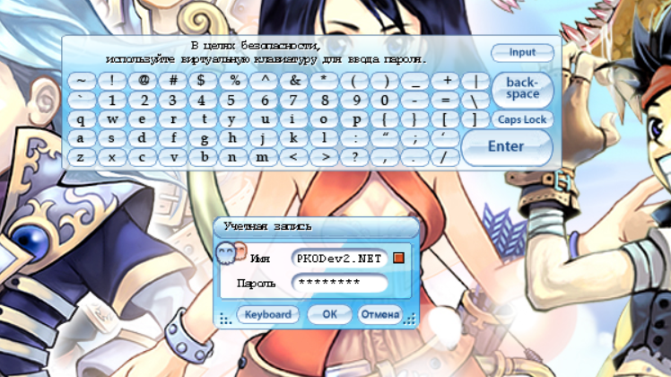

Привет!

В данном гайде мы научимся регистрировать аккаунты для входа в игру — как для игроков, так и для гейм-мастеров (GM).

## Немного теории.

Игровые аккаунты хранятся в базе данных `AccountServer`, которую использует одноименный сервис ("подсервер", `AccountServer.exe`) для аутентификации вновь подключившихся клиентов. Для этого в БД есть таблица `account_login` — каждая строка таблицы (запись) представляет собой аккаунт. Соответственно, чтобы создать аккаунт, нужно добавить новую запись в эту таблицу. Достаточно заполнить два поля: логин (`name`) и пароль (`password`), остальные поля СУБД заполнит значениями по умолчанию.

Логин должен быть уникальным — не бывает нескольких аккаунтов с одним и тем же логином (ваш КО). Минимальная длина логина — `5 символов`, а максимальная — `20 символов`. В качестве символов используются `английские буквы и цифры`. Регистр букв не важен: `Player` и `PlAyEr` — это один и тот же аккаунт.

Теперь обсудим пароли для игровых аккаунтов. Дело в том, что пароли не хранятся в базе данных в открытом виде, и вернее было бы сказать, что пароли вообще не хранятся в БД. Вместо паролей в БД хранятся их `хэши`, некие уникальные отпечатки паролей. Такие отпечатки представляют собой строки фиксированной длины. Хэши получаются путем преобразования паролей с помощью хэш-функции — хэширования. Есть большое число алгоритмов хэш-функций, но сервер Пиратии использует только один из них — `алгоритм MD5`. При входных паролях любой длины он выдает соответствующие им строки длиной `32` символа, состоящие из `букв a-f` и `цифр 0-9`. Например, MD5-хэшем пароля `123456` (никогда не используйте такие простые пароли!) является строка `e10adc3949ba59abbe56e057f20f883e`. Для хэширования данных по алгоритму MD5 существует множество программ и онлайн-сервисов, например, [md5.cz](https://www.md5.cz/). Особенностью хэширования является то, что это односторонний процесс, и из хэша нельзя обратно получить пароль. Конечно, теоретически можно воспользоваться методами перебора (т.н. "брутфорс") или подбором по словарю, но это нецелесообразно по времени и при текущем уровне развития техники может занимать годы. Как вы уже догадываетесь, такой подход к хранению паролей необходим для целей обеспечения безопасности данных игроков. В случае, если злоумышленники получат доступ к базе данных, то они не смогут узнать пароли от игровых аккаунтов. Возникает закономерный вопрос, что же делать, если игрок забудет пароль от своего аккаунта, ведь администратор сервера не может просто взять и посмотреть пароль игрока в БД? В такой ситуации нужно просто сбросить старый пароль, поменяв его хэш на хэш некоторого нового, известного, пароля, и сообщить новый пароль игроку. И последнее действие, которое нужно совершить над паролем перед его записью в таблицу базы данных — привести его хэш к `ВЕРХНЕМУ` регистру. Если этого не сделать, то AccountServer будет выдавать ошибку `"Неверный пароль"`. Минимальная длина пароля — `5 символов`, а максимальная — `20 символов`. В качестве символов используются `английские буквы и цифры`.

Итак, резюмируя все вышесказанное по отношению к паролям, пароли необходимо преобразовывать по следующей формуле:

```
Пароль в базе данных = ВЕРХНИЙ_РЕГИСТР(MD5(Пароль, который игрок вводит при входе в игру))
```

Пример для пароля `pkodev2`:

```
Пароль pkodev2 соответствует требованиям по длине и символам, захэшируем его и преобразуем хэш в верхний регистр:
pkodev2 -> 32099cde9a3c8d3f8ca380c0518dc858 -> 32099CDE9A3C8D3F8CA380C0518DC858
```

таким образом, значение `32099CDE9A3C8D3F8CA380C0518DC858` записываем в поле `password` таблицы `account_login`.

Последнее, что стоит упомянуть в теоретическом разделе гайда — это тип (роль) аккаунта. Аккаунт может быть 3-ех типов:

1. Обычный (игрок);
2. Администратор (Game Master, GM);
3. Модератор (HD).

В зависимости от типа, аккаунт может иметь доступ к тем или иным `GM-командам`, необходмым для администрирования сервера. Пожалуйста, обратитесь к гайду "GM команды" для более подробного описания ролей аккаунтов и доступных им команд, и непосредственного описания самих команд. Тип аккаунта определяется его `GM-уровнем`. GM-уровень — это число от `0 до 99` включительно, где `0` — это игрок, `1..20` — HD и `21..99` — GM. Информация о типе аккаунта хранится в таблице `account` базы данных `GameDB`. С данной БД работают сервисы `GameServer` и `GroupServer`. В таблице `account` так же содержится часть информации об игровых аккаунтах, в том числе необходимое нам поле `gm` — GM-уровень аккаунта. Таблицы `accout_login` из базы данных `AccountServer` и `account` из базы данных `GameDB` связаны полями `name` и `act_name` соответственно. `Внимание:` если вы редактиурете GM-уровень аккаунта, который в данный момент времени онлайн, то для применения нового GM-уровня нужно выполнить повторный вход в игру.

Перейдем к практическим действиям. Существует несколько способов создать новый аккаунт, начнем с самого сложного — создания аккаунтов вручную. Он даст понимание как все устроено.

## Способ 1. Составляем и выполняем SQL-запросы.

Обладая новыми знаниями, создадим новый аккаунт c логином `V3ct0r` и паролем `pkodev2net`.

Для этого:
1. Захэшируем пароль и приведем его хэш к верхнему регистру:
    ```
    pkodev2net -> db9468773ec65715ae3f1c5c41a45143 -> DB9468773EC65715AE3F1C5C41A45143
    ```
2. Cоставим SQL-запрос на вставку данных в таблицу `account_login` базы данных `AccountServer`:

   ```
   USE AccountServer
   INSERT INTO account_login (name, password) VALUES ('V3ct0r', 'DB9468773EC65715AE3F1C5C41A45143')
   ```

3. Откроем программу `Microsoft SQL Server Management Studio`, подключимся к SQL-серверу и создадим новый запрос (кнопка `"Новый запрос"`, кнопка `"New Query"` или сочетание клавиш `Ctrl + N`). В многострочное поле редактирования SQL-запроса введем составленный в `пункте (2)` запрос:
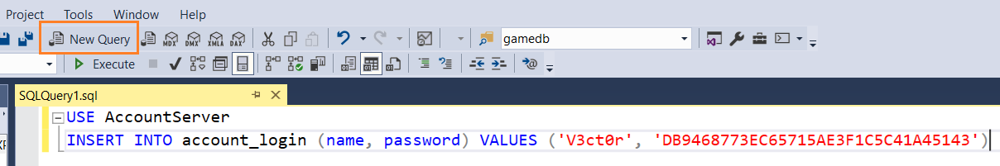

4. Выполним SQL запрос (кнопка `"Выполнить"`, кнопка `"Execute"` или клавиша `F5`). При успешном выполнении запроса в окне `"Messages"` (`"Сообщения"`) должны появиться сообщения `"Query executed successfully"` (`"Запрос успешно выполнен"`) и `"(1 row affected)"` (`"(1 строка затронута)"`):
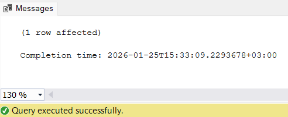

    В случае ошибок, проанализируйте ошибки, скорректируйте SQL-запрос и попробуйте выполнить его снова. Например, если вы попытаетесь создать аккаунт, логин которого уже используется для другого аккаунта, вы получите ошибку выполнения SQL-запроса.

5. Мы успешно создали новый игровой аккаунт и можем с его помощью войти в игру!

Далее, при необходимости, наделим аккаунт `V3ct0r` GM-правами `99-уровня`:
1. Если вы еще не входили в игру используя целевой аккаунт, то информация о нем будет отсутствовать в таблице `account` базы данных `GameDB`. В этом случае нужно будет добавить соответствующую запись вручную, заполнив поля `act_id`, `act_name` и `gm`:
    * Поле `act_id` представляет собой числовой идентификатор записи и должно быть уникальным. Узнаем максимальное значение поля `act_id` в таблице, для этого выполним SQL-запрос (см. `пункты (3) и (4)` выше):
       ```
       USE GameDB
       SELECT MAX(act_id) FROM account
       ```
       В моем случае СУБД вернула значение `10`. К этому значению прибавим единицу и будем использовать полученное значение `11` далее. Это гарантирует уникальность значения.
      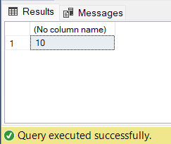
   * Составим и выполним SQL-запрос на вставку новых данных в таблицу `account`:
       ```
       USE GameDB
       INSERT INTO account (act_id, act_name, gm) VALUES (11, 'V3ct0r', 99)
       ```

2. Если вы ранее входили в игру, то информация об аккаунте уже содержится в таблице `account` и достаточно её обновить:
    * Составим и выполним SQL-запрос на обновление информации об аккаунте `V3ct0r`:
       ```
       USE GameDB;
       UPDATE account SET gm = 99 WHERE act_name = 'V3ct0r'
       ```
3. Аккаунт `V3ct0r` теперь является GM-аккаунтом 99-уровня и имеет доступ к GM-командам;
4. Таким же образом вы можете наделять GM-правами другие аккаунты, либо, наоборот, снимать GM-права.


## Способ 2. Создаем аккаунты мышью в MSSQL Management Studio.

Данный способ не требует знаний основ языка SQL, но нужно так же знать как хранятся аккаунты в базе данных Пиратии.

В качестве примере будем создавать тот же аккаунт c логином `V3ct0r` и паролем `pkodev2net`.

Создание аккаунта:
1. Откройте программу `Microsoft SQL Server Management Studio` и подключитесь к SQL-серверу:
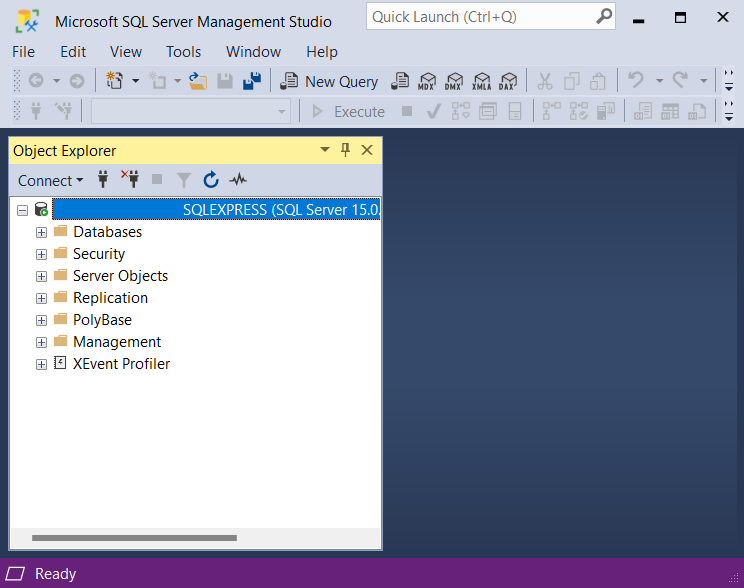
2. В окне `"Object Explorer"` (`"Обзор объектов"`) найдите дерево `"Databases"` (`"Базы данных"`), а в нем — базу данных `AccountServer`;

    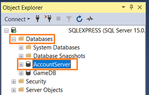
3. Раскройте дерево базы данных `AccountServer`, найдите поддерево `"Tables"` (`"Таблицы"`), а в нем — таблицу `account_login`. Кликните по таблице правой кнопкой мыши и выберите пункт `"Edit Top 200 Rows"` (`"Редактировать первые 200 строк"`):

   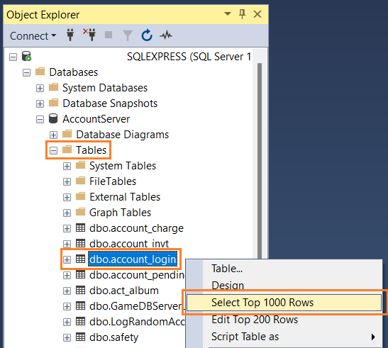
4. Появится окно редактирования данных в таблице. Кликните левой кнопкой мыши по полю `name` в последней, пустой строке, там где записано значение `NULL`. Появится поле редактирования текста, введите в него желаемый логин для нового аккаунта (в нашем примере это `V3ct0r`). Далее, таким же образом введите захешированный алгоритмом MD5 пароль в верхнем регистре (в нашем примере это `DB9468773EC65715AE3F1C5C41A45143`) в поле `password`:

    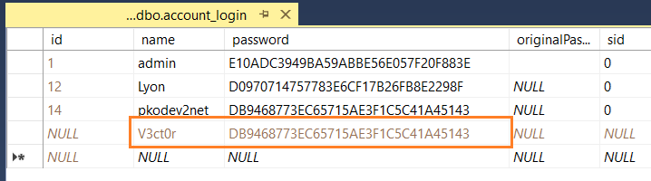
5. Кликните правой кнопкой по таблице и в появившемся контекстном меню выберите пункт `"Execute SQL"` (`"Выполнить SQL"`):

    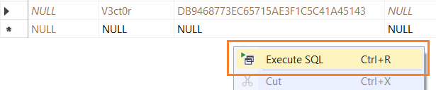
6. В результате будет создан новый аккаунт, а записи, которую вы создали на шаге (4) будет автоматически присвоен `id`:

    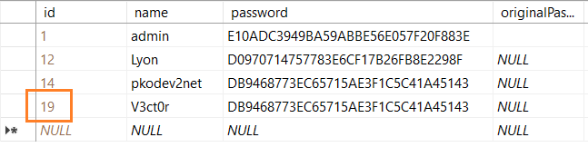

Добавление GM-прав:
1. Откройте программу `Microsoft SQL Server Management Studio` и подключитесь к SQL-серверу;
2. В окне `"Object Explorer"` (`"Обзор объектов"`) найдите дерево `"Databases"` (`"Базы данных"`), а в нем — базу данных `GameDB`;
3. Раскройте дерево базы данных `GameDB`, найдите поддерево `"Tables"` (`"Таблицы"`), а в нем — таблицу `account`. Кликните по таблице правой кнопкой мыши и выберите пункт `"Edit Top 200 Rows"` (`"Редактировать первые 200 строк"`). Появится окно редактирования данных в таблице;
4. В случае, если вы еще не входили в игру используя целевой аккаунт:
    * Найдите в таблице запись в максимальным значением поля `act_id` (в моем случае это будет значение `10`). Прибавьте к полученному значению единицу;
    * Кликните левой кнопкой мыши по полю `act_id` в последней, пустой строке, там где записано значение `NULL`. Появится поле редактирования текста, введите в него полученное на предыдущем шаге значение поля `act_id` плюс единица (в моем случае это будет значение `11`). Далее, таким же образом введите логин целевого аккаунта в поле `act_name`, а в поле `gm` введите значение желаемого уровня GM:

    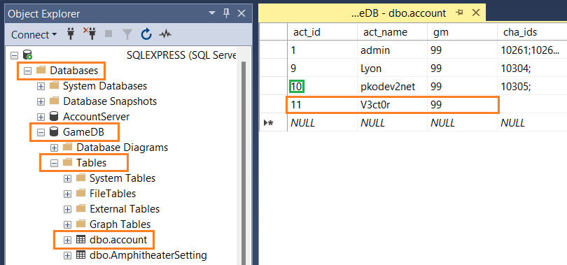
5. В случае, если вы уже входили в игру используя целевой аккаунт:
    * Найдите в таблице строку, у которой в поле `act_name` записано значение логина целевого аккаунта (в нашем примере это `V3ct0r`). У найденной строки отредактируйте поле `gm`, вписав в него значение требуемого GM-уровня:

    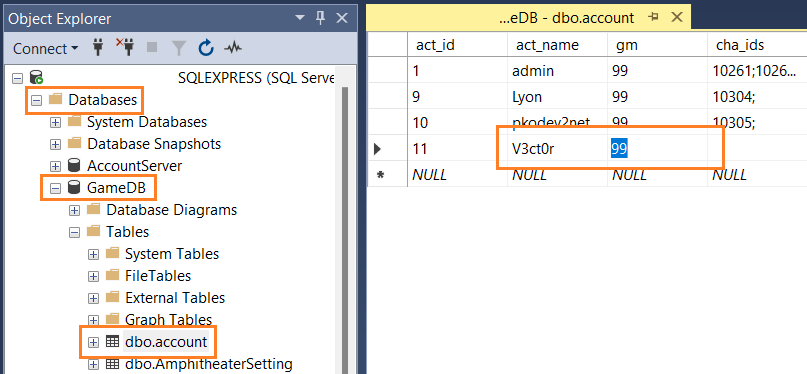
6. Кликните правой кнопкой по таблице и в появившемся контекстном меню выберите пункт `"Execute SQL"` (`"Выполнить SQL"`). GM-уровень аккаунта будет обновлен.


## Способ 3. Используем специальные программы для создания аккаунтов.

Разработчики из нашего Сообщества создали несколько удобных программ с графическим интерфейсом пользователя для создания акканутов.

Как правило, от пользователя таких программ требуется только единовременно настроить подключение к базе данных и у него появляется возможность быстро регистрировать аккаунты. При этом, также не требуется каждый раз хэшировать пароль и переводить его хэш в верхний регистр. Дополнительно можно выбирать тип аккаунта — игрок или GM.

Рассмотрим работу с одной из таких программ на примере программы `MD Account Creator 4 TOP` (или `"Создать учетную запись"`).


1. Запустите программу;
2. Нажмите кнопку `"Настройки"` (шестеренка в левом нижнем углу);
3. В появившемся окне `"Настройки"` заполните соответствующие поля данными для подключения к вашему MSSQL-серверу;
4. Нажмите кнопку "Проверить подключение" и, при положительном результуте, закройте окно. В ином случае повторите `пункт (3)`. При последующих запусках программы повторять `пункты 2..4` не потребуется; 
5. В основном окне программы заполните поля `"Логин"` и `"Пароль"` валидными значениями;
6. При необходимости, выберите тип аккаунта (`GM`, `Игрок`);
7. Нажмите кнопку `"Создать"`. Если в `пункте 5` были введены корректные значения логина и пароля, то будет создан новый аккаунт, и появится соответствующее сообщение, иначе появится сообщение об ошибке.

## Способ 4. Веб-обвязка.

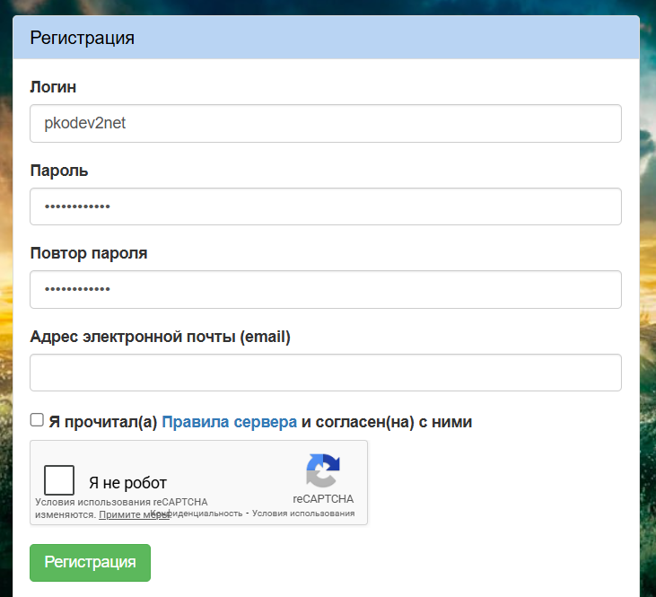

На реальном игровом проекте новые игроки могут прийти в любое время и им потребуются аккаунты для входа в игру. Регистрировать аккаунты вручную в таком случае не самая лучшая идея - вам нужно быть готовыми 24/7 обрабатывать заявки игроков, что в действительности нереально, а если вы не успеете и заставите игроков ожидать слишком долго, то игроки могут разочароваться и уйти. Конечно, исключения составляют серверы, которые работают по принципу белого списка, но такие проекты встречаются крайне редко. Необходимо дать игрокам возможность самим регистрировать аккаунты в любое удобное для них время. Для этого, как правило, используются веб-обвязки с соответствующим функционалом, например, PkoSite или "Веб-обвязка для сервера Пиратии от PKODev.NET". Вы можете найти веб-обвязки для вашего сервера и инструкции по их настройке в соответствующем разделе на нашем форуме, либо, используя вновь полученные из настоящего гайда знания, разработать свою веб-обвязку с применением таких языков программирования как PHP, Python, JavaScript и других. В последнее время стали популярны Telegram- и Discord-боты, функционал регистрации игровых аккаунтов можно реализовать и через мессенджеры.

Итак, все вышесказанное делает процесс создания аккаунтов более удобным для игроков, что, в свою очередь, повышает их лояльность и вовлеченность по отношению к вашему проекту.

---

Пишите в комментариях, если у вас остались вопросы или есть замечания!

Благодарю за внимание!
