# Установка сервера Пиратии (Tales of Pirates, Pirate King Online)


Всем привет!

В данном гайде я расскажу как установить и настроить сервер Пиратии шаг за шагом на примере серверных файлов версии 1.3х. Под версией 1.3x подразумеваются самые распространенные версии игры, которые сегодня используются большинством проектов: 1.35, 1.36, 1.38 и 1.39. Это деление условно и все версии 1.3x совместимы между собой. Например, клиент версии 1.36 может работать с сервером версии 1.39. Также существуют серверные файлы версии 2.x и скомпилированные из исходных кодов, например, файлы Corsairs Online. Их так же можно установить и настроить следуя настоящей инструкции, но процесс установки может в определенной мере отличаться.

Гайд предназначен для новичков в нашем Сообществе администраторов и разработчиков серверов Пиратии и содержит подробную инструкцию с изображениями, которая позволит установить сервер с нуля. По прочтении статьи читатель сможет запустить свой игровой мир и войти в него используя игровой клиент.

**Содержание гайда:**

1. Вам понадобится;
2. Архитектура сервера Пиратии;
3. Установка Microsoft SQL Server и SQL Server Management Studio;
4. Установка и настройка серверных файлов;
5. Запуск сервера;
6. Проверка соединения с игровым сервером;
7. Остановка игрового сервера;
8. Подключение игрового клиента к серверу;
9. Распространенные ошибки и их исправление.

Приступим к установке и настройке нового игрового мира. Первым шагом определим инструменты, которые понадобятся для успешного выполнения поставленной задачи.

---

## 1. Вам понадобится

0. **Теоретическая подготовка**. Основы работы с операционной системой семейства **Windows**, базовые знания архитектуры "**клиент-сервер**", понимание терминов "**База данных (БД)**" и "**Система управления базами данных (СУБД)**". Поскольку те или иные программы, а также сообщения об ошибках могут быть на английском языке, то понадобится **знание английского языка** начального уровня.
1. Компьютер под управлением операционной системы семейства **Windows** (серверные редакции Server и пользовательские XP/Vista/7/8/10). Исполняемые файлы сервера скомпилированы под архитектуру **x86 (Win32)**, поэтому система должна поддерживать 32-разрядный режим работы. К аппаратной части предъявляются следующие требования: **многоядерный процессор с частотой от 2.0 ГГц**; от **4 Гб оперативной памяти**; **2 Гб свободного места на диске для серверных файлов, баз данных и файлов журнала ("логов")**; **сетевое подключение со скоростью от 10 Мбит/с** на 1000 клиентов. Таким образом, исходя из современных реалий, можно сделать вывод, что игровой сервер предъявляет невысокие требования к железу, поэтому вышеприведенные характеристики носят скорее рекомендательный и условный характер. Например, Вы можете запустить игровой сервер и на более слабом компьютере, но это, в свою очередь, может привести к замедлению его работы, а значит и к задержкам у игроков, что отразится на комфорте процесса игры. Если же Вы планируете запустить сервер только для себя (одиночная игра, проведение различных тестов, написание скриптов), то Вам не нужно заботиться о производительности сервера, а требования к железу будут менее строгими.
2. Система управления базами данных (СУБД) **Microsoft SQL Server**. Именно такую СУБД выбрали разработчики игрового сервера Пиратии для хранения состояния игрового процесса: учетных записей пользователей, персонажей, гильдий, кораблей и других объектов. Существует много версий Microsoft SQL Server. В гайде я буду использовать бесплатную версию **Microsoft SQL Server 2017 Express**, которую можно скачать с [официального сайта Microsoft](https://www.microsoft.com/ru-RU/download/details.aspx?id=55994). Несмотря на ограничения Express редакции, её возможностей вполне хватит для обеспечения работы игрового сервера. Для управления SQL-сервером Вам понадобится **SQL Server Management Studio**, который также можно найти на [сайте Microsoft](https://learn.microsoft.com/ru-ru/ssms/install/install?view=sql-server-ver15).
3. **Серверные файлы** ("сборка"). Это приложения, файлы и скрипты, которые служат для создания и поддержания игрового процесса. В минимальной конфигурации должны включать в себя серверные приложения **AccountServer.exe**, **GroupServer.exe**, **GameServer.exe** и **GateServer.exe**. Функции и задачи данных приложений будут рассмотрены далее. Найти сборку сервера можно в разделе "~~Сборки серверов~~" на нашем форуме или в ~~Архиве полезных файлов для сервера и клиента~~. В качестве примера я буду использовать серверные файлы ~~Pirate King Online 1.38~~.
4. **Базы данных**. В соответствии с пунктом (**2**) определяют структуру хранения игровых объектов на диске и используются игровым сервером для хранения информации о состоянии игрового мира. Представлены файлами **GameDB_Data.mdf**, **GameDB_log.ldf**, **AccountServer_Data.mdf** и **AccountServer_log.ldf**. Как правило, поставляются вместе с серверными файлами. Если в скачанных Вами серверных файлах нет баз данных, то их можно найти в другой сборке, либо в ~~Архиве полезных файлов для сервера и клиента~~. 
5. ~~**Генератор паролей для .cfg**~~. Кроме прочих настроек, в конфигурационных файлах сервера (.cfg) указываются данные для подключения к SQL-серверу, в том числе и пароли пользователей баз данных GameDB и AccountServer. В целях безопасности пароли в конфигурационных файлах должны быть зашифрованы специальным алгоритмом, для чего служит данная программа.
6. **Текстовый редактор** для редактирования конфигурационных файлов сервера. Подойдет стандартный блокнот (notepad.exe), но я рекомендую программу [Notepad++](https://notepad-plus-plus.org/downloads/), которая на порядок удобнее обычного блокнота.
7. **Игровой клиент** для подключения к установленному игровому серверу и его тестирования. Вы можете подобрать игровой клиент к выбранной сборке сервера в теме "~~Официальные клиенты~~" на нашем форуме.
8. ~~**IP Changer**~~. Перед подключением к серверу игровому клиенту необходимо задать сетевой адрес по которому подключаться. Данная программа предназначена для настройки адреса игрового сервера в клиенте.
9. ~~**Программа для создания аккаунтов**~~. Для того, чтобы войти в игровой мир, Вам нужна учетная запись игрока или администратора, которую можно зарегистрировать с помощью приведенной программы.

После того, как мы сформулировали основные требования и определили необходимые инструменты для установки сервера Пиратии и подключения к нему клиента, проведем небольшой экскурс по архитектуре игрового сервера, чтобы получить понимание процесса его настройки и запуска в будущем.

## 2. Архитектура сервера Пиратии

Архитектура сервера приведена на рисунке ниже. Она позволяет понять как в общем случае устроены серверные файлы и каковы взаимосвязи между серверным программным обеспечением: что в него входит, что является сервером и что является клиентом по отношению друг к другу.

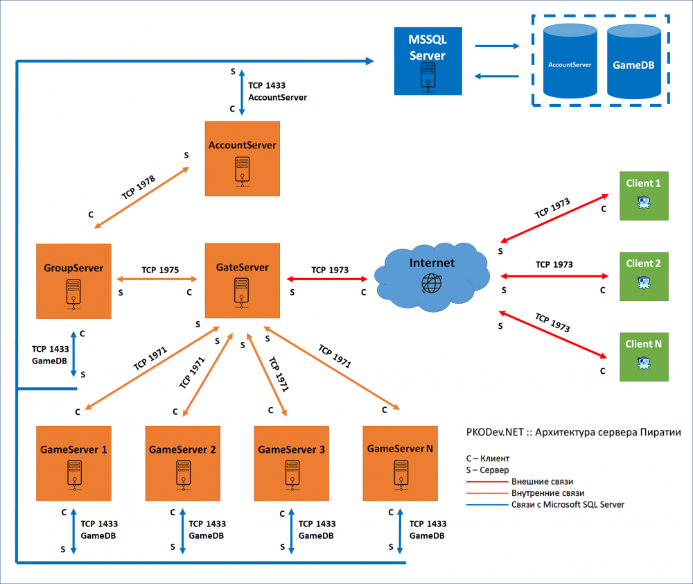

Как видно из схемы в состав системы входят **AccountServer**, **GameServer**, **GroupServer**, **GateServer**, **Microsoft SQL Server** с базами данных **AccountServer** и **GameDB**, а также **игровой клиент (Client)**. Всё клиент-серверное взаимодействие между приложениями осуществляется с помощью сетевых пакетов по протоколу **TCP**. Изучим для чего нужен каждый элемент системы.

1. **Игровой клиент (Client)** — приложение с которым взаимодействует конечный пользователь (игрок). Визуализирует состояние игрового мира вокруг персонажа игрока, полученное от сервера через сеть Интернет. Под визуализацией понимается отрисовка игровой карты с объектами на ней (например, суша и море, деревья, здания, дороги), персонажей других игроков, монстров, неигровых персонажей (NPC)  и так далее — всего того, что на своем мониторе видит игрок в процессе игры. Кроме визуализации клиент посредством графического интерфейса пользователя (GUI) предоставляет последнему возможность влиять на состояние игрового мира и процесс игры с помощью клавиатуры и мыши, отправляя на сервер различные действия, например, создание персонажа, перемещение персонажа в игровом мире, атака монстров, взаимодействие с NPC, отправка сообщений в чат и другие действия, которые разрешены на сервере правилами игры. Для пользователя клиент является игрой в обычном понимании. В рассматриваемой системе игровых клиентов может быть от 1 до нескольких тысяч. Подключается через **1973** порт к **GateServer**.
2. **GateServer** — принимает входящие соединения через **1973** порт от игровых клиентов и выступает в роли шлюза, через который игровой клиент взаимодействует с **GroupServer**, **AccountServer** и **GameServer**. Является сервером на **1971** порту по отношению к **GameServer** и клиентом на **1975** порту по отношению к **GroupServer**. Для распределения нагрузки в системе может быть несколько GateServer. Например, можно настроить сервер таким образом, что игроки из России подключаются к GateServer, который расположен в Москве, а игроки из Европы подключается к GateServer, который запущен на хостинге в дата-центре, расположенном в Германии, что позволит снизить задержки (пинг) при передаче сетевых пакетов от клиента на сервер и обратно. В целях безопасности игрового процесса GateServer шифрует весь сетевой трафик, который передается между сервером и клиентами.
3. **GroupServer** — отвечает за создание и удаление персонажей с аккаунта пользователя, систему друзей и отрядов, общение между игроками в чатах (мировой, торговый, отряд, гильдия, ЛС) и диалогах. GroupServer также участвует в процессе аутентификации игроков на сервере, передавая пакеты аутентификации, полученные от **GateServer**, далее в **AccountServer**. Является сервером на **1975** порту по отношению GateServer и клиентом по отношению к AccountServer на **1978** порту. Кроме того, подключается в роли клиента через **1433** порт к **Microsoft SQL Server** для работы с базой данных **GameDB**. Как и в случае с GateServer, в системе может быть несколько GroupServer для распределения нагрузки, но, как правило, в реальных проектах используется один экземпляр GroupServer.
4. **AccountServer** — нужен для аутентификации игроков на сервере путем сравнения полученных от пользователя логина и пароля с соответствующими логином и паролем в базе данных. Если игрок ввел верные логин и пароль, то он допускается к игре на сервере, в противном случае получает сообщение об ошибке авторизации и отключается от сервера. Является сервером по отношению к **GroupServer** на порту **1978**. Работает с базой данных **AccountServer**, поэтому является клиентом **Microsoft SQL Server** на порту **1433**. Как и в случае с GateServer, в системе может быть несколько AccountServer для распределения нагрузки, но обычно в реальных проектах используется один экземпляр AccountServer.
5. **GameServer** — основной игровой сервер, где осуществляется вся логика игры. Обеспечивает игровой процесс и синхронизацию состояния игрового мира с игровыми клиентами: является клиентом на **1971** порту по отношению к **GateServer**, через который принимает действия от игровых клиентов, проверяет их корректность, и, в случае соблюдения установленных правил игры, вносит изменения в состояние игрового мира, после чего оповещает об этом все остальные игровые клиенты. Параллельно с обработкой действий игровых клиентов, с определенной частотой (обычно 20 Гц) обновляет игровой мир, например, для создания погодных явлений или управления монстрами с помощью искусственного интеллекта (AI). Для сохранения состояния игрового мира использует базу данных **GameDB** и является клиентом **Microsoft SQL Server** на порту **1433**. GameServer является самым высоконагруженным элементом в системе и потребляет больше всего вычислительных ресурсов и памяти, поэтому в реальных проектах нагрузка распределяется между от **3** до **5** GameServer. В игре существует три основные локации: Аскарон, Магический Океан и Великий Синий Океан размером 4096 x 4096 условных единиц — это самые большие локации в игре. Помимо того факта, что они будут занимать много памяти в ОЗУ, в этих локациях одновременно могут быть тысячи игроков, монстров и NPC, следовательно, целесообразно распределить нагрузку между несколькими экземплярами GameServer и запускать основные локации по одной вместе с частью второстепенных на разных GameServer.
6. **Microsoft SQL Server и базы данных AccountServer, GameDB** — Microsoft SQL Server является механизмом, с помощью которого **AccountServer** работает с одноименной базой данных **AccountServer**, а **GameServer** и **GroupServer** работают с базой данных **GameDB**, используя язык **SQL**. Является сервером на порту **1433** по отношению к AccountServer, GameServer и GroupServer. В базе данных AccountServer хранятся игровые аккаунты и различная служебная информация, например, логи. В базе данных GameDB хранятся персонажи, предметы, гильдии, корабли, списки друзей и менторов, дублируется список аккаунтов для их связи с персонажами, кроме того, каждому аккаунту здесь присваивается уровень GM и секретный код, так же присутствует и служебная информация.

Следует отметить, что рассмотренная архитектура является самой распространенной и применяется в большинстве проектов, но Вы можете перестраивать её под свои нужды:

1. Вы можете изменить стандартные порты **1433**, **1971**, **1973**, **1975**, **1978** на любые другие [не зарезервированные порты](https://ru.wikipedia.org/wiki/Список_портов_TCP_и_UDP);
2. Вы можете переименовывать базы данных **AccountServer** и **GameDB** (потребуется редактирование некоторых исполняемых файлов сервера);
3. Вы можете запускать несколько экземпляров **Microsoft SQL Server**, **GateServer**, **GroupServer**, **AccountServer**, **GameServer** и настраивать взаимосвязи между ними в целях распределения нагрузки и повышения производительности игрового процесса;
4. В систему могут быть добавлены новые элементы, например, сервер **встроенного в клиент магазина игровых предметов (IGS)**, **сервер для фильтрации исходящих от клиентов пакетов (FilterServer)**, **сервер "оффлайн" ларьков (StallServer)**, который позволяет игрокам торговать в ларьках не находясь в игре.

Теперь, когда Вы получили представление об архитектуре и основных элементах сервера Пиратии, приступим к его установке и настройке. Начнем с установки Microsoft SQL Server.

## 3. Установка Microsoft SQL Server и SQL Server Management Studio

### 3.1 Установка Microsoft SQL Server

Перейдите на страницу загрузки [Microsoft SQL Server 2017 Express](https://www.microsoft.com/ru-RU/download/details.aspx?id=55994) и нажмите кнопку "**Скачать**". На Ваш компьютер будет загружен дистрибутив **SQLServer2017-SSEI-Expr.exe**.

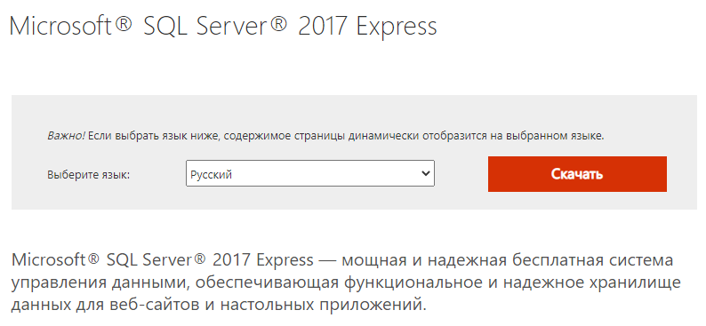

Запустите дистрибутив **SQLServer2017-SSEI-Expr.exe** от имени администратора и выберите тип установки "**Пользовательский**".

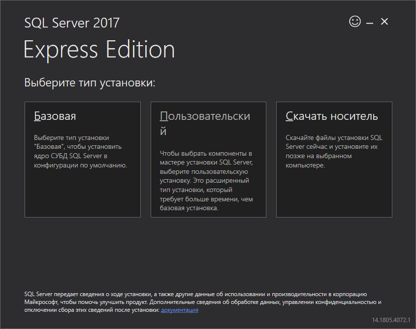

Выберите директорию на диске, куда будет загружен пакет установки, необходимый для установки экземпляра Microsoft SQL Server, и нажмите кнопку "**Установить**".

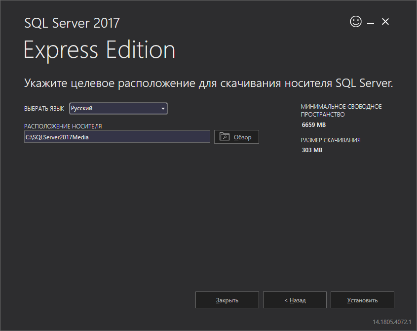

Начнется процесс загрузки и распаковки пакета установки. Дождитесь его окончания.

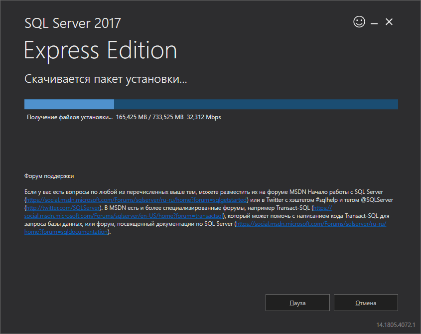

После загрузки и распаковки пакета установки должно открыться окно "**Центр установки SQL Server**". Если оно по какой-либо причине не открылось, перейдите в директорию, которую Вы указали в процессе загрузки пакета установки (расположение носителя), и запустите центр установки SQL Server вручную (файл **SETUP.exe**).  В окне центра установки SQL Server на вкладке "**Установка**" выберите пункт меню "**Новая установка изолированного экземпляра SQL Server или добавление компонентов к существующей установке**".

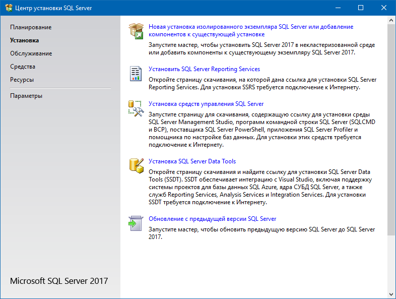

Начнется процесс установки экземпляра SQL Server 2017. Примите условия лицензионного соглашения и нажмите кнопку "**Далее**".

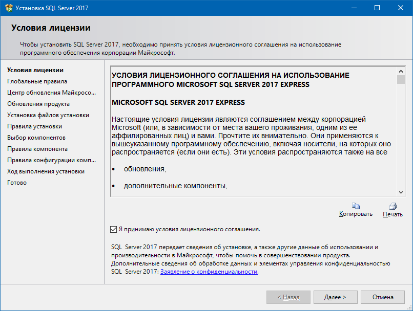

Убедитесь, что в системе соблюдены все условия для успешной установки SQL Server на вкладке "**Глобальные правила**", после чего нажмите кнопку "**Далее**". При возникновении проблем примите меры для их устранения и продолжите установку.

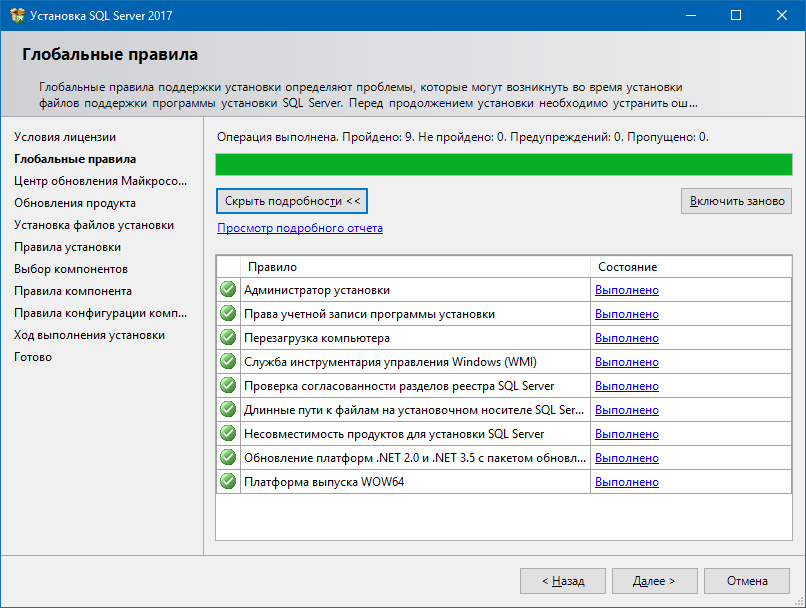

На странице "**Центр обновления Майкрософт**" по Вашему усмотрению установите флажок "**Использовать Центр обновления Майкрософт для проверки наличия обновлений**" и нажмите кнопку "**Далее**".

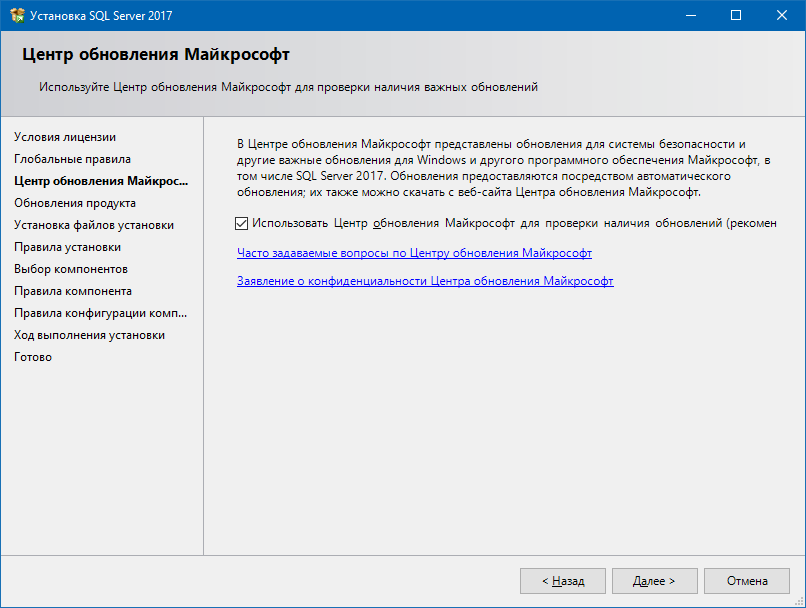

Программа установки проверит наличие обновлений и при необходимости их установит.

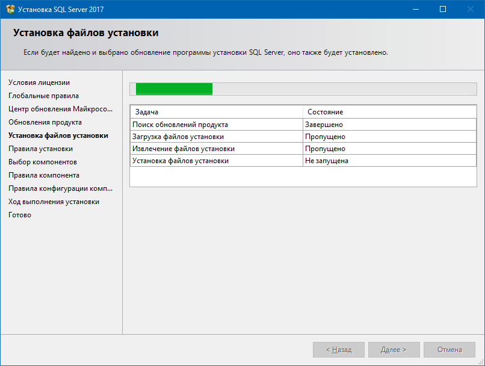

Далее программа установки еще раз проведет диагностику системы на наличие потенциальных проблем, которые могут возникнуть в процессе установки Microsoft SQL Server 2017. Убедитесь, что потенциальных проблем не обнаружено. Правило "**Брандмауэр Windows**" может быть в состоянии "**Предупреждение**", если включен Брандмауэр Windows. Для продолжения установки это не критично, но могут возникнуть проблемы в будущем, если Вы захотите обеспечить удаленный доступ к экземпляру SQL Server. Чтобы их избежать, Вам нужно будет открыть порт для подключения к SQL Server (по умолчанию **1433**) в фаерволе Windows. Нажмите кнопку "**Далее**".

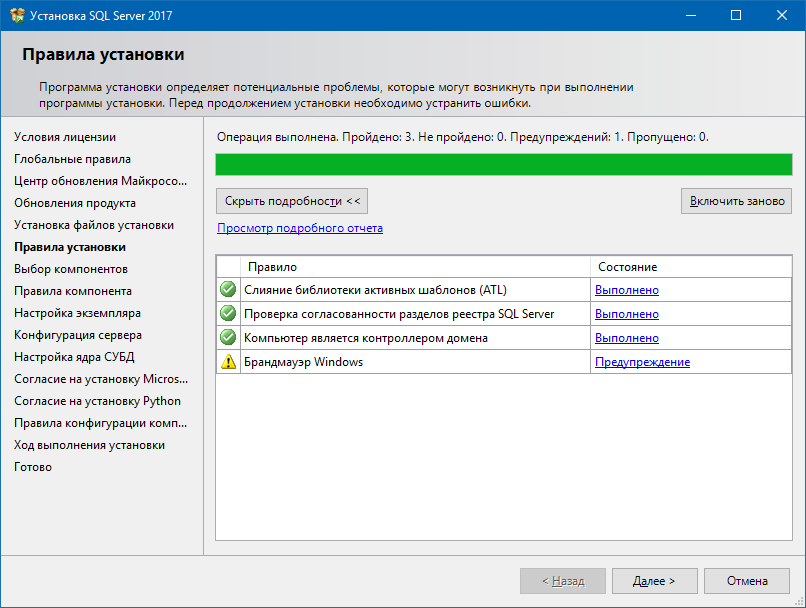

На странице "**Выбор компонентов**" отметьте только компонент "**Службы ядра СУБД**" и укажите корневой каталог экземпляра. Нажмите кнопку "**Далее**".

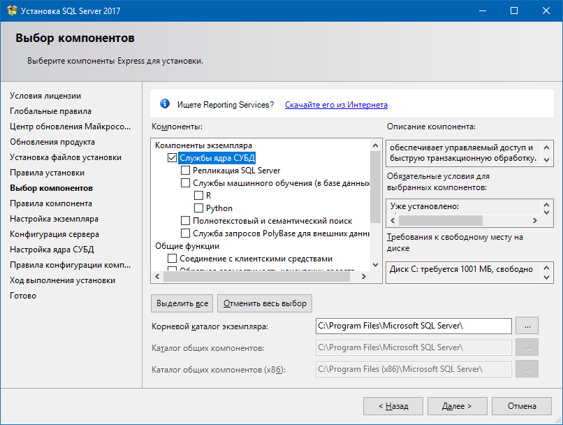

Затем Вам будет предложено указать имя и идентификатор экземпляра SQL Server. Выберите флажок "**Экземпляр по умолчанию**", а в поле "**Идентификатор экземпляра**" введите название экземпляра SQL Server по Вашему усмотрению. Нажмите кнопку "**Далее**".

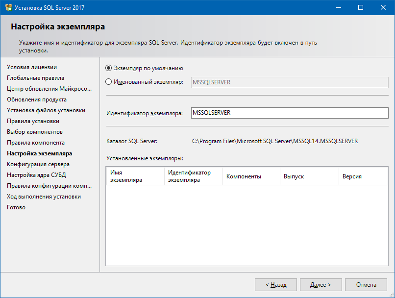

Страницу "**Конфигурация сервера**" оставьте без изменений и нажмите кнопку "**Далее**".

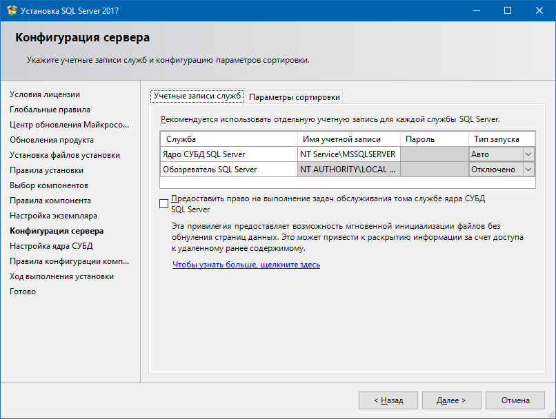

При **настройке ядра СУБД** выберите флажок "**Режим проверки подлинности Windows**" и убедитесь, что в список администраторов SQL Server добавлен текущий пользователь. На остальных вкладках страницы "**Настройка ядра СУБД**" изменения не требуются. Нажмите кнопку "**Далее**".

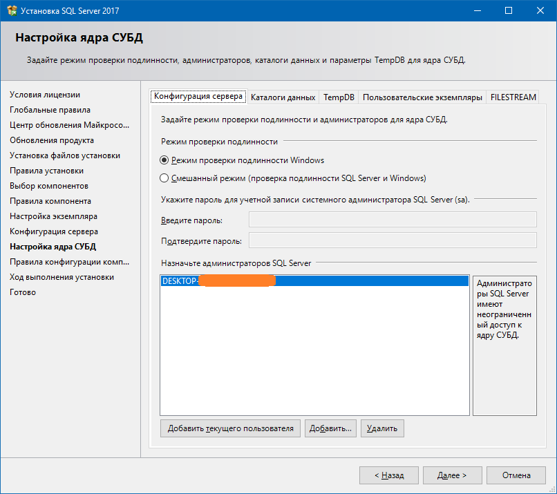

Далее начнется процесс копирования файлов, требующихся для работы экземпляра SQL Server, и их конфигурирование. Дождитесь окончания данного процесса.

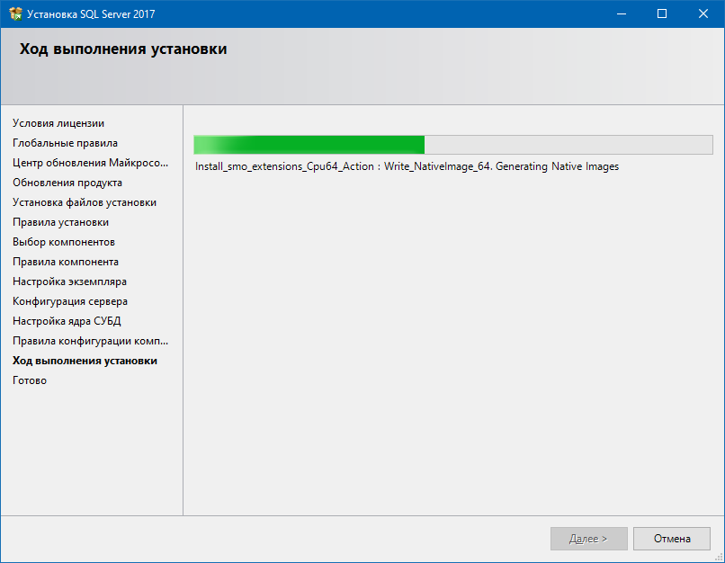

В результате экземпляр SQL Server должен быть успешно установлен. Закройте Программу установки SQL Server 2017.

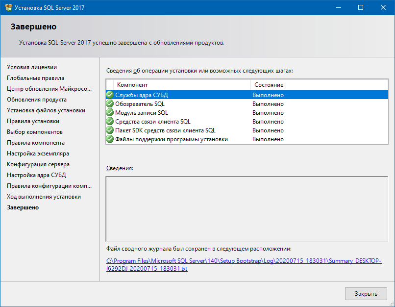

### 3.2 Установка SQL Server Management Studio

Перейдите на [страницу загрузки Microsoft SQL Server Management Studio](https://docs.microsoft.com/ru-ru/sql/ssms/download-sql-server-management-studio-ssms?view=sql-server-ver15) и нажмите ссылку "**Скачайте SQL Server Management Studio (SSMS)**". На Ваш компьютер будет загружен дистрибутив **SSMS-Setup-RUS.exe**.

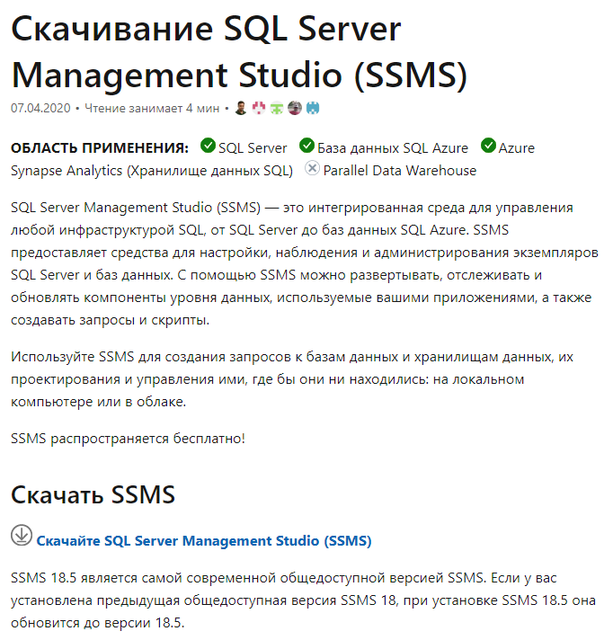

Запустите дистрибутив **SSMS-Setup-RUS.exe** от имени администратора. Появится окно программы установки среды Microsoft SQL Server Management Studio. Выберите директорию, в которую будет установлена среда, и нажмите кнопку "**Установить**".

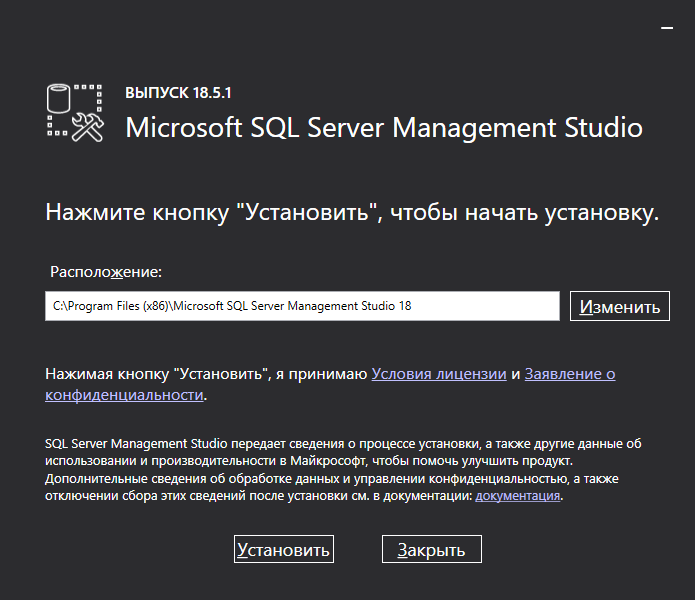

Начнется процесс загрузки и установки требуемых пакетов и компонентов, а также непосредственная установка SQL Server Management Studio. Дождитесь окончания процесса.

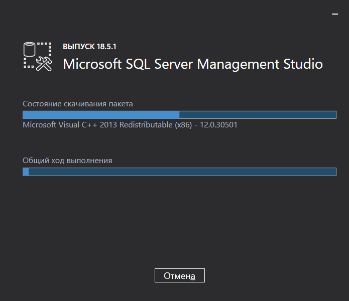

После завершения процесса необходимо перезагрузить компьютер.

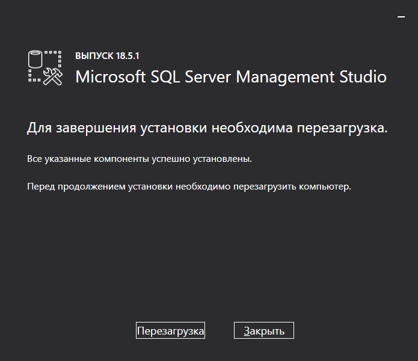

### 3.3 Проверка работоспособности Microsoft SQL Server и его настройка

После перезагрузки компьютера установленный экземпляр SQL Server должен автоматически начать работу. Запустите программу **Microsoft SQL Server Management Studio 18** от имени администратора и подключитесь ко вновь установленному экземпляру используя проверку подлинности Windows.

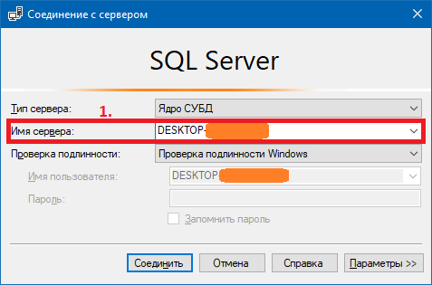

Соединение должно быть успешно установлено, и в окне "**Обозреватель объектов**" появится текущий экземпляр SQL Server. Запомните название текущего экземпляра (**1**), оно понадобится далее при настройке конфигурационных файлов сервера (.cfg).

```
Название экземпляра SQL Server: DESKTOP-XXXXXXX
```

Кликните по серверу правой кнопкой мыши и в контекстном меню выберите пункт "**Свойства**".

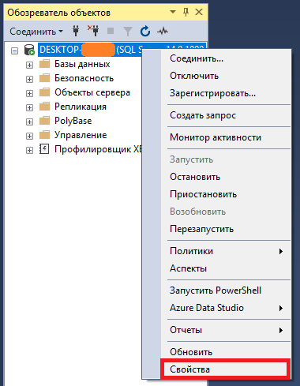

В появившемся окне "**Свойства сервера**" перейдите на страницу "**Безопасность**" и в группе "**Серверная проверка подлинности**" выберите "**Проверка подлинности SQL Server и Windows**". Нажмите кнопку "**ОК**".

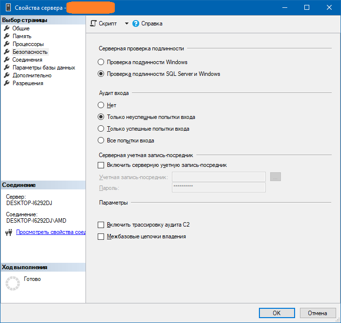

Для того, чтобы произведенные изменения вступили в силу, необходимо перезапустить SQL Server. Для этого снова кликните по серверу правой кнопкой мыши в окне "**Обозреватель объектов**" и в контекстном меню выберите пункт "**Перезапустить**". На вопрос о перезапуске службы SQL Server ответьте "**Да**". Экземпляр сервера будет перезапущен.

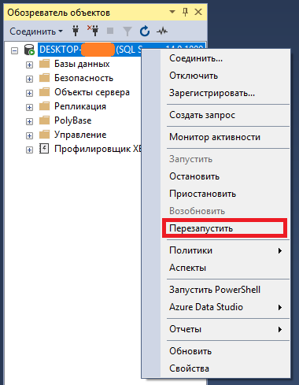

Установка и настройка Microsoft SQL Server завершена. Далее установим и настроим серверные файлы игры.

## 4. Установка и настройка серверных файлов

### 4.1 Выбор серверных файлов

Скачайте интересующие Вас серверные файлы на Ваш компьютер и распакуйте их в любое удобное для Вас место на диске.

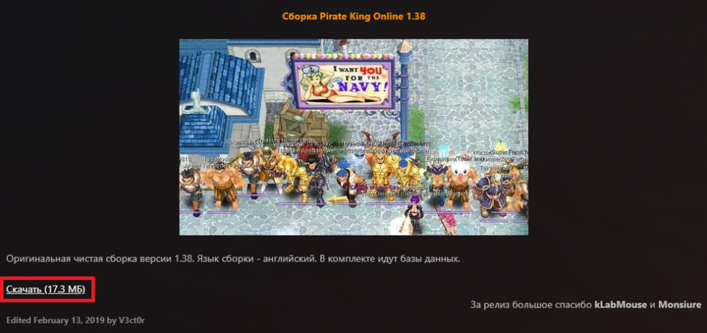

### 4.2 Прикрепление баз данных к Microsoft SQL Server

Вместе с серверными файлами должны поставляться базы данных **AccountServer** и **GameDB**. Если в загруженной Вами сборке сервера базы данных не обнаружены, то найдите их в другой сборке или в ~~Архиве полезных файлов для сервера и клиента~~. Эти базы данных необходимо прикрепить к ранее установленному экземпляру SQL Server перед настройкой и запуском исполняемых файлов сервера Пиратии. Для этого запустите программу **Microsoft SQL Server Management Studio 18** от имени администратора и подключитесь к Вашему экземпляру SQL Server используя проверку подлинности Windows. В обозревателе объектов кликните правкой кнопкой по папке "**Базы данных**" и в контекстном меню выберите задачу "**Присоединить...**".

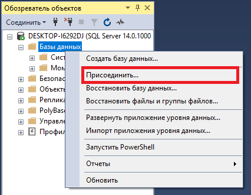

Появится окно "**Присоединение баз данных**", в котором Вам необходимо по очереди указать пути до баз данных **AccountServer** и **GameDB** (**1**), убедиться, что очередная база данных добавлена в список для присоединения (**2**) и нажать кнопку "**ОК**" (**3**).

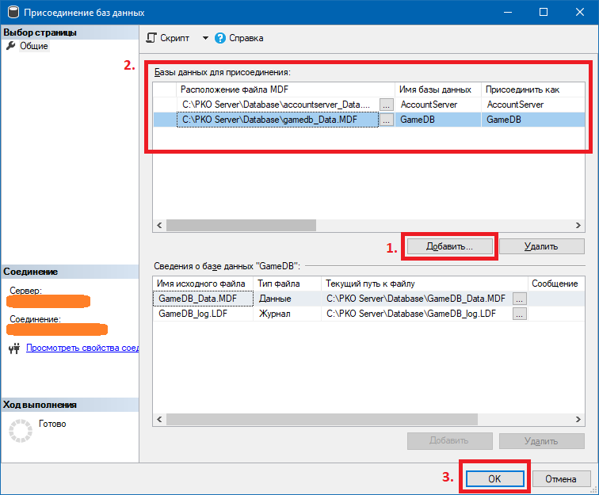

В папке "**Базы данных**" текущего экземпляра SQL Server в окне "**Обозреватель объектов**" должны появиться **AccountServer** и **GameDB**.

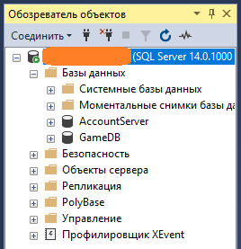

### 4.3 Создание пользователей для баз данных

Теперь необходимо создать пользователей баз данных **AccountServer** и **GameDB** для приложений **AccountServer**, **GroupServer** и **GameServer**. С помощью этих пользователей GroupServer и GameServer будут подключаться к Microsoft SQL Server и работать с базой данных GameDB, а AccountServer будет работать с одноименной базой данных AccountServer.

В рамках гайда создадим двух пользователей: одного для базы данных **GameDB**, второго для базы данных **AccountServer**. Из-за особенностей шифрования паролей пользователей баз данных в конфигурационных файлах сервера Пиратии, пароль каждого пользователя должен быть длиной **ровно 9 символов**. 

Придумаем данные пользователей:

**GameDB**

```
База данных: GameDB
Логин: PKODev_Game
Пароль: pkodevnet
```

**AccountServer**

```
База данных: AccountServer
Логин: PKODev_Account
Пароль: netpkodev
```

Далее по очереди добавим этих пользователей в экземпляр SQL Server и делегируем им доступ к соответствующим базам данных. Кликните правой кнопкой мыши по папке "**Безопасность**" текущего экземпляра SQL Server в окне "**Обозреватель объектов**" и в контекстном меню выберите команду "**Создать — Вход...**" (либо папка "**Имена для входа**" и команда "**Создать имя для входа...**").

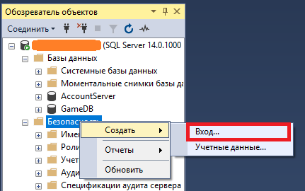

В окне "**Создание имени для входа**" на странице "**Общие**" введите имя пользователя (**1**), выберите переключатель "**Проверка подлинности SQL Server**" (**2**), введите пароль и подтверждение пароля (**3**), снимите флажок "**Требовать использование политики паролей**" (**4**). Выберите базу данных по умолчанию: для пользователя **PKODev_Game** база данных **GameDB** и для пользователя **PKODev_Account** база данных **AccountServer** (**5**). Далее перейдите на страницу "**Сопоставление пользователей**" (**6**).

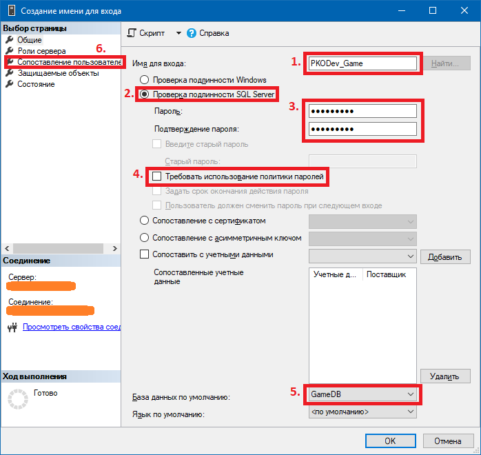

На странице "**Сопоставление пользователей**" отметьте флажком базу данных **GameDB** для пользователя **PKODev_Game** или базу данных **AccountServer** для пользователя **PKODev_Account** (**1**). В списке "**Членство в роли базы данных для: GameDB (AccountServer**)" снимите флажок с **db_owner** (**2**) и установите флажки **db_datawriter**, **db_datareader**, **db_ddladmin** (**3**). На этом создание очередного пользователя завершено. Нажмите кнопку "**ОК**" (**4**).

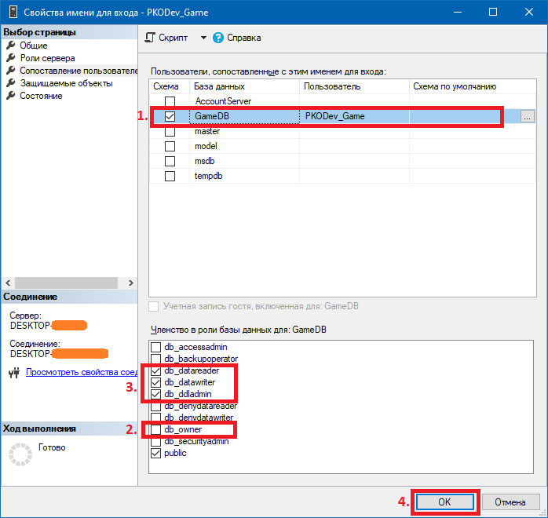

В подпапке "**Имена для входа**" папки "**Безопасность**" текущего экземпляра SQL Server в окне обозревателя объектов должны появиться два новых пользователя: **PKODev_Game** и **PKODev_Account**.

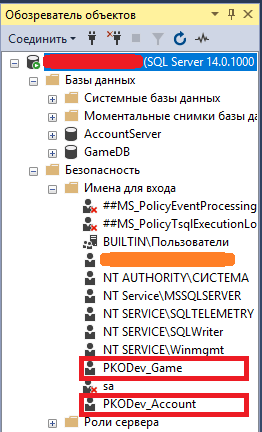

В результате мы прикрепили базы данных **GameDB** и **AccountServer** к экземпляру SQL Server и создали для них пользователей **PKODev_Game** и **PKODev_Account** соответственно. Сейчас сервер Пиратии может работать с базами данных, поэтому приступаем к его настройке.

### 4.4 Шифрование паролей пользователей баз данных для конфигурационных файлов (.cfg) сервера

Как было отмечено выше, пароли пользователей баз данных указываются в конфигурационных файлах сервера (.cfg) в зашифрованном виде, соответственно их необходимо зашифровать. Скачайте ~~Генератор паролей для .cfg~~, распакуйте загруженный архив и откройте файл **passgen.ini** в любом текстовом редакторе. Присвойте параметру "**pass**" пароль для пользователя базы данных **GameDB** и сохраните файл:

```
pass=pkodevnet
```

Запустите приложение **passgen.exe**. В консольном окне Вы получите зашифрованный пароль. Скопируйте зашифрованный пароль и сохраните его в текстовом файле. Он понадобится далее в процессе настройки конфигурационных файлов игрового  сервера.


Повторите операцию шифрования пароля для пользователя базы данных **AccountServer**:

```
pass=netpkodev
```

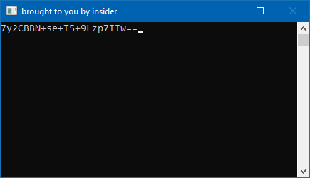

В итоге мы получили данные серверного программного обеспечения Пиратии для подключения к Microsoft SQL Server:

```
Название экземпляра SQL Server: DESKTOP-XXXXXXX
База данных: GameDB
Пользователь: PKODev_Game 
Зашифрованный пароль для .cfg: SUOh8nJKCe125gImJdapNA==
```

```
Название экземпляра SQL Server: DESKTOP-XXXXXXX
База данных: AccountServer
Пользователь: PKODev_Account 
Зашифрованный пароль для .cfg: 7y2CBBN+se+T5+9Lzp7IIw==
```

### 4.5 Настройка AccountServer

Начнем настройку игрового сервера с настройки **AccountServer**. Откройте конфигурационный файл **AccountServer.cfg** в любом текстовом редакторе. Найдите секцию **db**, которая отвечает за подключение к Microsoft SQL Server, и заполните соответствующие параметры:

* **dbserver** — адрес или название экземпляра Micrososft SQL Server;
* **db** — название базы данных для хранения информации об игровых аккаунтах. По умолчанию AccountServer;
* **userid** — Логин пользователя базы данных **AccountServer**;
* **passwd** — Зашифрованный пароль пользователя базы данных **AccountServer**.

```
[db]
dbserver = DESKTOP-XXXXXXX
db = AccountServer
userid = PKODev_Account
passwd = 7y2CBBN+se+T5+9Lzp7IIw==
```

В секции **net** укажите адрес и порт, на которых AccountServer будет принимать входящие соединения от GroupServer:

* **listen_ip** — IP-адрес AccountServer по отношению к GroupServer. Если AccountServer и GroupServer будут запускаться на одном и том же компьютере, то введите IP-адрес **127.0.0.1**;
* **listen_port** —  Сетевой TCP порт, на котором AccountServer будет принимать входящие соединения от GroupServer. По умолчанию **1978**.

```
[net]
listen_port = 1978
listen_ip = 127.0.0.1
```

Сохраните файл **AccountServer.cfg**. Более изменений данного файла не требуется.

### 4.6 Настройка GroupServer

Откройте конфигурационный файл **GroupServer.cfg** в любом текстовом редакторе. По аналогии с AccountServer.cfg в данном конфигурационном файле необходимо настроить подключение к серверу баз данных. Для этого используется секция **Database** со следующими параметрами:

* **IP** — адрес или название экземпляра Micrososft SQL Server;
* **DB** — название базы данных для хранения информации о состоянии игрового мира. По умолчанию **GameDB**;
* **Login** — Логин пользователя базы данных **GameDB**;
* **Password** — Зашифрованный пароль пользователя базы данных **GameDB**.

```
[Database]
IP = DESKTOP-XXXXXXX
DB = GameDB
Login = PKODev_Game
Password = SUOh8nJKCe125gImJdapNA==
```

Настройте параметры подключения GroupServer к AccountServer в секции **AccountServer**:

* **IP** — IP-адрес **AccountServer**;
* **Port** — Сетевой TCP порт **AccountServer**.

```
[AccountServer]
IP = 127.0.0.1
Port = 1978
```

Как Вы помните, GroupServer является сервером по отношению к GateServer. В секции **Main** указываются адрес и порт, через которые GroupServer будет принимать входящие соединения от GateServer:

* **Listen_IP** — IP-адрес GroupServer по отношению к GateServer. Если GroupServer и GateServer будут запускаться на одном и том же компьютере, то введите IP-адрес **127.0.0.1**;
* **Listen_Port** — Сетевой TCP порт, на котором GroupServer будет принимать входящие соединения от GateServer . По умолчанию **1975**.

```
[Main]
Listen_Port = 1975
Listen_IP = 127.0.0.1
```

Сохраните файл **GroupServer.cfg**. Настройка GroupServer завершена.

### 4.7 Настройка GateServer

Откройте конфигурационный файл GateServer.cfg в любом текстовом редакторе. Настройте параметры подключения GateServer к GroupServer в секции GroupServer:

* **IP** — IP-адрес **GroupServer**;
* **Port** — Сетевой TCP порт **GroupServer**.

```
[GroupServer]
IP = 127.0.0.1
Port = 1975
```

В секции **ToClient** необходимо указать параметры подключения игровых клиентов к GateServer:

* IP** — IP-адрес GateServer и соответственно адрес Вашего сервера, через который будут подключаться игровые клиенты (игроки). Введите адрес **0.0.0.0**, который обозначает все IP-адреса данного компьютера. Например, к серверу можно будет подключиться одновременно через локальный адрес 127.0.0.1, локальную сеть 192.168.0.99 и внешний IP-адрес 54.36.6.113 через сеть Интернет (адреса выдуманы для примера);
* **Port** — Сетевой TCP порт, на котором GateServer будет принимать входящие соединения от игровых клиентов, то есть внешний порт Вашего сервера. По умолчанию **1973**. Данный порт должен быть открыт в Брандмауэре Windows (и иных программах-межсетевых экранах), а также на стороне Вашего Интернет-провайдера или поставщика услуг хостинга. Если Ваш компьютер подключен к Интернету через маршрутизатор, то в маршрутизаторе необходимо пробросить внешний порт на Ваш компьютер для доступа к игровому серверу из сети Интернет.
* **CommEncrypt** — параметр, который отвечает за шифрование входящего и исходящего трафика, то есть сетевых пакетов данных, которые передаются от GateServer к игровым клиентам и от игровых клиентов к GateServer. При значении **1** шифрование включено, при значении **0** — выключено. Рекомендуется включить шифрование для повышения уровня защищенности сервера по отношению к различным вредоносным программам (боты, программы для редактирования и флуда пакетами типа WPE Pro/RPE, твики позволяющие отдельным игрокам получать преимущество над другими и так далее).

```
[ToClient]
IP = 0.0.0.0
Port = 1973
CommEncrypt = 1
```

Настройте адрес и порт, через которые GateServer будет принимать входящие соединения от GameServer в секции **ToGameServer**:

* **IP** — IP-адрес GateServer по отношению к GameServer. Если GateServer и GameServerбудут запускаться на одном и том же компьютере, то введите IP-адрес **127.0.0.1**;
* **Port** — Сетевой TCP порт, на котором GateServer будет принимать входящие соединения от GameServer. По умолчанию **1971**.

```
[ToGameServer]
IP = 127.0.0.1
Port = 1971
```

В секции **Main** в параметре **Version** укажите версию клиента, которая допускается для подключения к серверу. На стороне клиента данная версия "зашита" в Game.exe и передается двумя байтами в пакете аутентификации. Самое распространенное значение версии клиента **136**:

```
[Main]
Version = 136
```

При несовпадении версии сервера и клиента пользователь получит сообщение об ошибке "**Неверная версия игры**":


Сохраните файл **GateServer.cfg**. Настройка GateServer завершена.

### 4.8 Настройка GameServer

Первоначальная настройка GameServer сводится к указанию его **уникального имени (идентификатора)**, **параметров подключения к GateServer**, **параметров подключения к Micrososft SQL Server** и **списка локаций**, которые будут запущены на текущем экземпляре GameServer. 

В начале данного гайда мы сделали вывод, что GameServer должно быть в системе от **3** до **5** экземпляров для распределения между ними нагрузки, поэтому необходимо создать несколько конфигурационных файлов (.cfg) — для каждого экземпляра GameServer отдельный .cfg-файл. В качестве примера создадим 3 конфигурационных файла: **GameServer.cfg**, **GameServer2.cfg** и **GameServer3.cfg**. Чтобы получить новые .cfg-файлы, скопируйте GameServer.cfg два раза и переименуйте копии в GameServer2.cfg и GameServer3.cfg. По очереди настройте каждый конфигурационный файл GameServer используя текстовый редактор.

Так как к GateServer подключается более одного GameServer, GateServer необходимо однозначно различать подключенные GameServer для маршрутизации сетевых пакетов данных от игровых клиентов. Для этого у каждого GameServer есть свой уникальный идентификатор, который указывается в секции **ID** в виде произвольной текстовой строки.

Для **GameServer.cfg** задайте идентификатор, который Вы можете выбрать по своему усмотрению:

```
[ID]
name = GameServer00
```

Для **GameServer2.cfg**:

```
[ID]
name = GameServer01
```

Для **GameServer3.cfg**:

```
[ID]
name = GameServer02
```

Далее настройте параметры подключения к GateServer в секции **Gate**, которые указываются с помощью ключа **gate** в виде строки "**<IP-адрес>, <порт>**", где **<IP-адрес>** это адрес GateServer, а **<порт>** соответственно порт, на котором GateServer принимает входящие соединения от GameServer:

```
[Gate]
gate = 127.0.0.1, 1971
```

Затем необходимо указать параметры подключения к Microsoft SQL Server в секции **DB** с помощью следующих параметров:

* **db_ip**  — адрес или название экземпляра Micrososft SQL Server;
* **db_usr** — Логин пользователя базы данных **GameDB**; 
* **db_pass** — Зашифрованный пароль пользователя базы данных **GameDB**.

```
[DB]
db_ip = DESKTOP-XXXXXXX
db_usr = PKODev_Game
db_pass = SUOh8nJKCe125gImJdapNA==
```

Осталось указать список локаций в секции **Map**, которые будут запущены на текущем экземпляре GameServer. В отличие от игрового наименования локаций, в серверных файлах локации носят кодовые имена. К примеру, **Аскарон** называется **garner**, **Магический Океан** это **magicsea**, а **Великий Синий Океан** — **darkblue**. Очередная локация включается ключом **map** c новой строки:

```
[Map]
map = <локация 1>
map = <локация 2>
. . .
map = <локация N>
```

Например, следующая секция **Map** запустит карты **Аскарон**,** Арену для командных сражений**, **Мир демонов** и **Мир демонов 2**:

```
[Map]
map = garner
map = teampk
map = puzzleworld
map = puzzleworld2
```

Полный список наименований игровых локаций, который связывает их с кодовыми именами, приведен ниже:

```
garner — Аскарон
magicsea — Магический Океан
darkblue — Великий Синий Океан
lonetower — Одинокая башня
eastgoaf — Серебрянные шахты, заброшенные шахты, логово черного дракона, логово черного дракона 2
secretgarden — Сад Эдель
darkswamp — Темная топь
abandonedcity — Забытый Город
abandonedcity2 — Забытый Город 2
abandonedcity3 — Забытый Город 3
puzzleworld — Мир Демонов
puzzleworld2 — Мир Демонов 2
teampk — Арена
jialebi — Небеса, база флота, остров сокровищ, остров скелетов
garner2 — Серебряный Хаос
hell(2-5) — Абаддон (2-5)
guildwar — Священная война
guildwar2 — Маленькая священная война
leiting2 — Мираж Громограда  
shalan2 — Мираж Шайтана 
binglang2 — Мираж Ледыни 
yschurch — Церковь   
07xmas —  Новогодняя деревня 2007
07xmas2 — Снежная война
prisonisland — Тюрьма
winterland — Остров Зимы  
mjing1 — 1-ый край Авроры
mjing2 — 2-ой край Авроры
mjing3 — 1-ый край Тьмы
mjing4 — 2-ой край Тьмы
starena* — Арены
heilong — Сундук черного дракона
darkhouse — Дом тьмы 
mingyun — Комната судьбы
```

**Примечание**: карты **garner**, **magicsea** и **darkblue** необходимо запускать на разных экземплярах GameServer.

Определите для каждого конфигурационного файла GameServer набор локаций. Локации **garner**, **maigcsea** и **darkblue** в соответствии с примечанием должны быть записаны в разных конфигурационных файлах. Для примера можно настроить конфигурационные файлы таким образом:

**GameServer.cfg**

```
map = garner
map = garner2
map = teampk
map = lonetower
map = puzzleworld
map = puzzleworld2
map = eastgoaf
map = leiting2
map = shalan2
map = binglang2
```

**GameServer2.cfg**

```
[Map]
map = magicsea
map = abandonedcity
map = abandonedcity2
map = abandonedcity3
map = darkswamp
map = secretgarden
map = guildwar
map = guildwar2
```

**GameServer3.cfg**

```
[Map]
map = darkblue
map = jialebi
map = hell
map = hell2
map = hell3
map = hell4
map = hell5
```

Сохраните очередной конфигурационный файл (.cfg) GameServer. После внесения изменений в последний конфигурационный файл, настройка экземпляров GameServer окончена.

Процесс установки и настройки серверного программного обеспечения Пиратии завершен. Далее приступим к запуску игрового мира.

## 5. Запуск сервера

### 5.1 Общие принципы и порядок запуска исполняемых файлов сервера

Поскольку игровой сервер состоит из нескольких исполняемых файлов (AccountServer.exe, GateServer.exe, GameServer.exe, GroupServer.exe), то их необходимо запускать в определенном порядке:

1. AccountServer;
2. Экземпляры GameServer;
3. GroupServer;
4. GateServer.

Для запуска AccountServer, GroupServer и GateServer достаточно запустить их исполняемые файлы из проводника. Если таким же образом запустить GameServer, то он будет использовать конфигурационный файл по умолчанию GameServer.cfg, поэтому при запуске очередного экземпляра GameServer необходимо дополнительно указать в параметрах его запуска конфигурационный файл, который необходимо использовать экземпляру для работы:

```
GameServer.exe <Конфигурационный файл>
```

Это можно сделать из **Командной строки (cmd.exe)**, либо с помощью пакетного **.bat-файла**.

Например, запуск GameServer из Командной строки (cmd.exe):

```
start GameServer.exe GameServer3.cfg
```

Данный .bat-файл запустит исполняемый файл GameServer с конфигурационным файлом GameServer3.cfg при условии, что GameServer.exe и .bat-файл находятся в одной и той же директории.

Чтобы запустить сразу несколько экземпляров GameServer с различными конфигурационными файлами, можно написать простой .bat-скрипт:

```
@echo off
start GameServer.exe GameServer.cfg
start GameServer.exe GameServer2.cfg
start GameServer.exe GameServer3.cfg
```

По аналогии можно сделать .bat-файл, который запустит весь игровой сервер, например, с рабочего стола:

```
@echo off

cd C:\PKO Server\AccountServer
start AccountServer.exe

cd C:\PKO Server\GameServer
start GameServer.exe GameServer.cfg
start GameServer.exe GameServer2.cfg
start GameServer.exe GameServer3.cfg

cd C:\PKO Server\GroupServer
start GroupServer.exe

cd C:\PKO Server\GateServer
start GateServer.exe
```

**Примечание**: в данном примере исполняемые файлы сервера находятся в соответствующих папках в директории **C:\PKO Server\**.

### 5.2 Запуск AccountServer

Запустите исполняемый файл **AccountServer.exe** любым удобным для Вас способом. В результате должно появиться два окна: форма со служебной информацией и консольное окно. В консольном окне не должно быть никаких ошибок. После запуска GroupServer, в окне со служебной информацией в списке **GroupServer** должен быть отображен подключенный GroupServer (поле **Status** имеет значение **connected**).

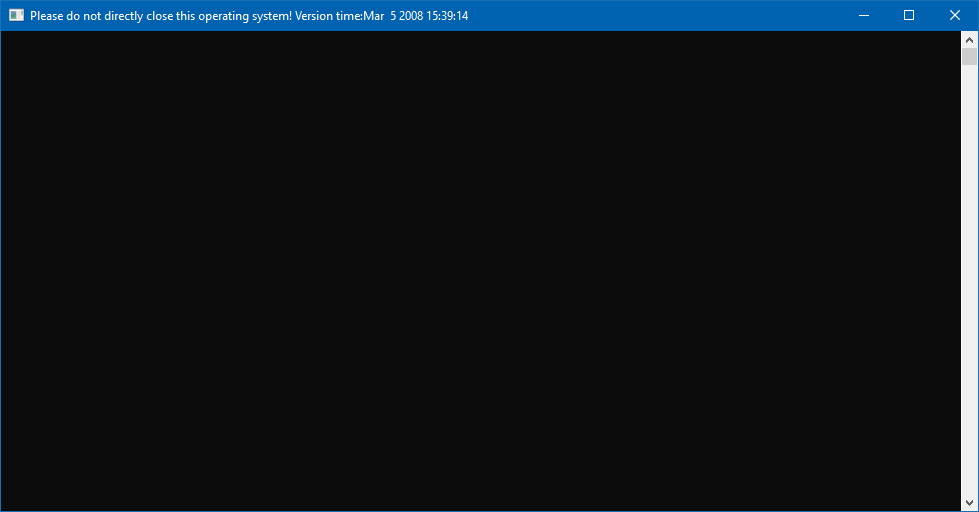

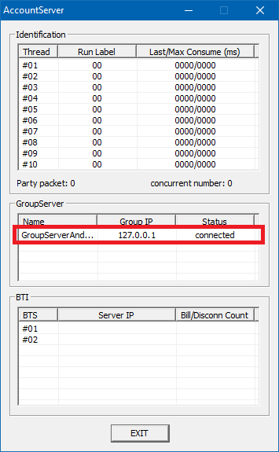

### 5.3 Запуск экземпляров GameServer

Запустите исполняемый файл **GameServer.exe** для каждого конфигурационного файла (.cfg) удобным для Вас способом. Появится несколько консольных окон и начнется процесс подключения к Microsoft SQL Server и загрузки каждого экземпляра GameServer. В процессе загрузки очередного экземпляра не должны возникать ошибки в виде записей в консоли или окон сообщений. Соединение с Microsoft SQL Server должно быть успешно установлено, что подтверждается соответствующей записью в консоли: "**Database Connected!**".

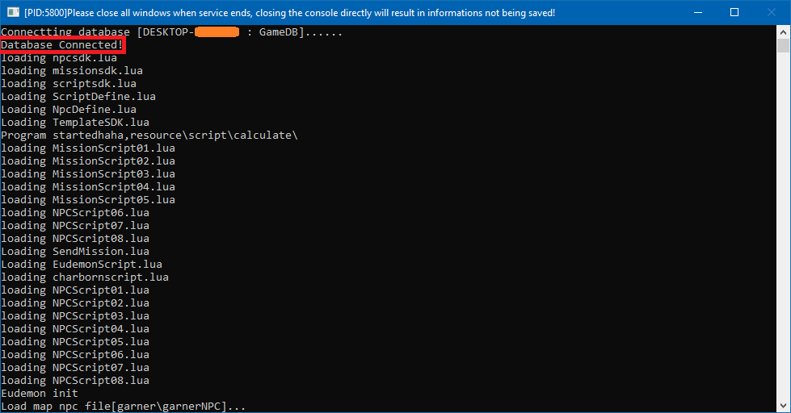

После успешного завершения загрузки GameServer должно появиться окно со служебной информацией: ID процесса (PID), частота обновления игрового мира (FPS), число персонажей игроков в игре (Player), загруженный конфигурационный файл (Config) и другая. Проверьте, что напротив каждой карты в списке "**Map List**" стоит надпись "**ok**", которая говорит об успешной загрузке локации. После запуска GateServer в списке "**Gate**" появится IP-адрес GateServer с надписью напротив "**connected**", к которому подключился данный экземпляр GameServer.

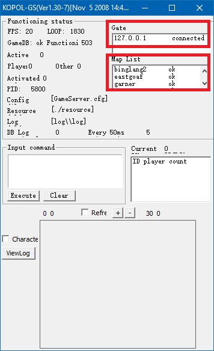

### 5.4 Запуск GroupServer

Запустите исполняемый файл **GroupServer.exe**. Появится консольное окно GroupServer. В окне не должно быть никаких сообщений об ошибках. После запуска AccountServer и GateServer появятся сообщения об успешном установлении соединения с данными приложениями.

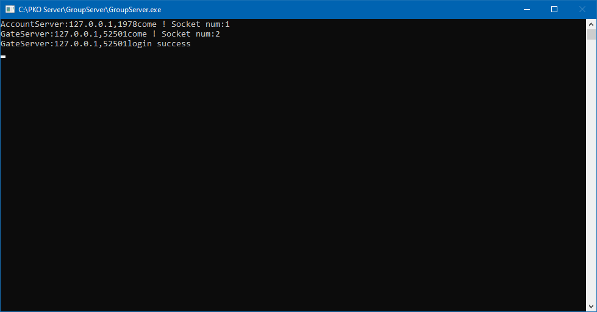

### 5.5 Запуск GateServer

Запустите исполняемый файл **GateServer.exe**. Появится консольное окно GateServer в котором должно быть сообщение об успешном запуске приложения.

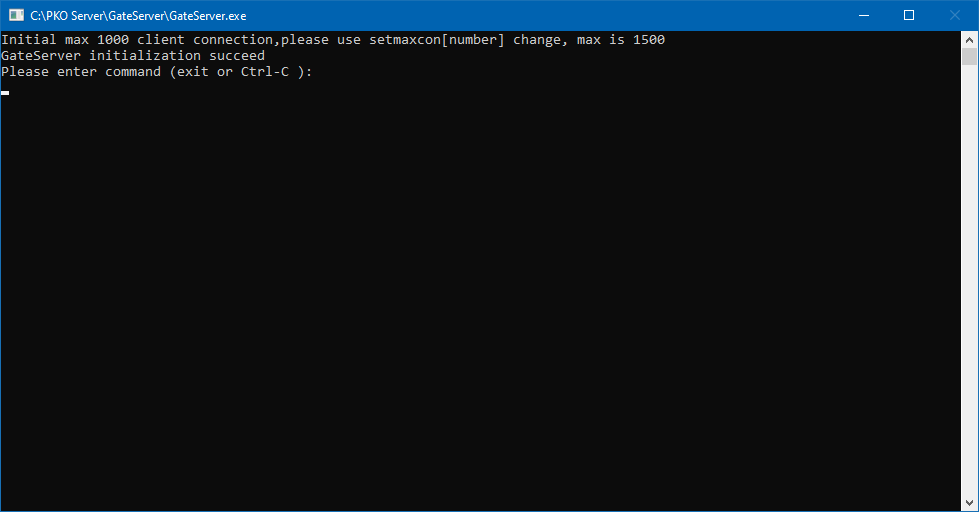

Игровой сервер Пиратии успешно запущен! Проверим его доступность для подключения к нему игровых клиентов.

## 6. Проверка соединения с игровым сервером

Для определения возможности подключения к Вашему игровому серверу из сети Интернет можно воспользоваться сервисами в Интернете, которые позволяют выполнить проверку внешнего порта сервера на доступность, например, [2ip — Проверка порта](https://2ip.io/ru/check-port/). В поле "**Порт**" введите внешний порт GateServer из секции **ToClient** конфигурационного файла **GateServer.cfg**. По умолчанию это порт **1973**.

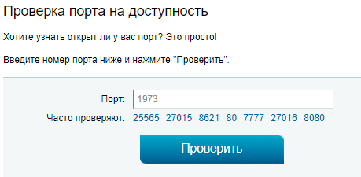

Нажмите кнопку "**Проверить**". При этом, исполняемый файл GateServer.exe должен быть запущен. Вы увидите сообщение "**Порт открыт**" если сервер доступен для подключения к нему, либо "**Порт закрыт**" в противном случае.


Еще одним способом проверки доступности игрового сервера является подключение к нему используя **клиент Telnet**. Для этого запустите клиент Telnet, например, встроенный в операционную систему Windows (сочетание клавиш Windows + R, открыть telnet.exe) и выполните в нем команду для подключения к игровому серверу:

```
open <IP-адрес> <Порт>
```


* **<IP-адрес>** — это IP-адрес игрового сервера, подключение через который Вы хотите проверить;
*  **<Порт>** — внешний порт игрового сервера.
 
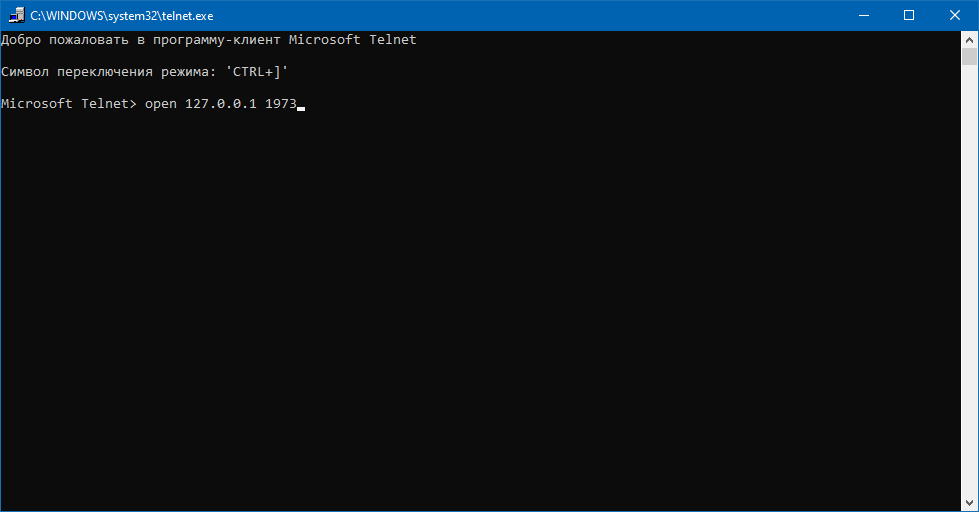

При доступности игрового сервера по указанному адресу Вы увидите строку с датой и временем подключения к серверу.

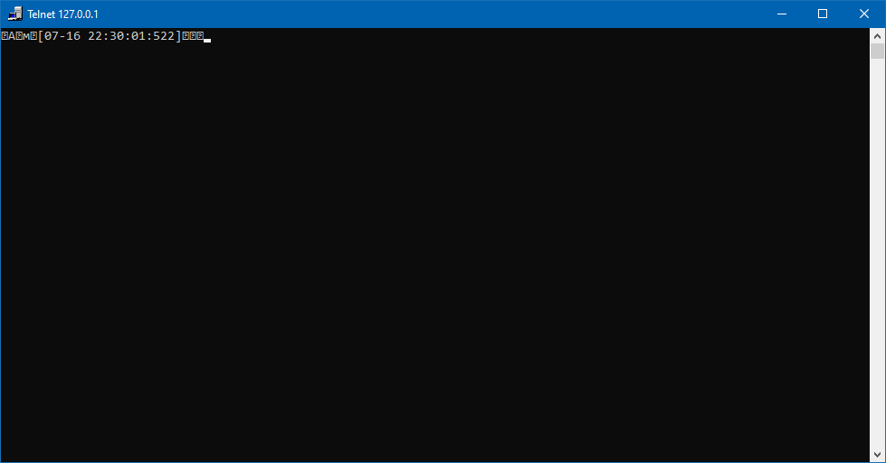

## 7. Остановка игрового сервера

Для корректного отключения игроков и сохранения состояния игрового мира в базах данных на диске, рекомендуется останавливать сервер в следующей последовательности:

1. Все экземпляры GameServer;
2. GroupServer;
3. GateServer;
4. AccountServer.

Отключать сервер через Диспетчер задач нельзя — можно потерять несохранённые игровые данные в памяти, что приведет к откату состояния игрового мира в прошлое при следующем запуске сервера. Перед остановкой сервера считается хорошим тоном предупредить игроков о предстоящем отключении. 

Чтобы завершить работу всех экземпляров GameServer, откройте служебное окно очередного экземпляра и введите в поле ввода команд (**1**) команду **Stop(X)**, где **X** — время в секундах, через которое текущий GameServer будет остановлен, после чего нажмите кнопку "**Execute**" (**2**).

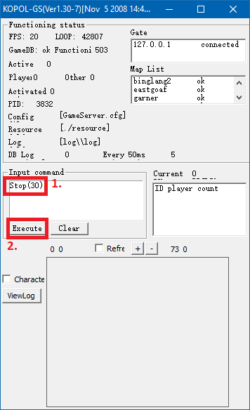

Когда все экземпляры GameServer завершат свою работу, остановите поочередно GroupServer, затем GateServer и после AccountServer с помощью сочетания клавиш **CTRL + C** в консольном окне. Процесс завершения работы очередного сервера может занять время, то есть приложения закроются не сразу.


## 8. Подключение игрового клиента к серверу

~~Чтобы войти во вновь созданный игровой мир, Вам понадобится игровой клиент, который можно скачать в данной теме на нашем форуме:~~

Выберите из списка доступных клиентов тот, который подойдет по версии к Вашим серверным файлам. Например, для сборки ~~Pirate King Online 1.38~~ подойдет официальный русский клиент версии 1.38.1:

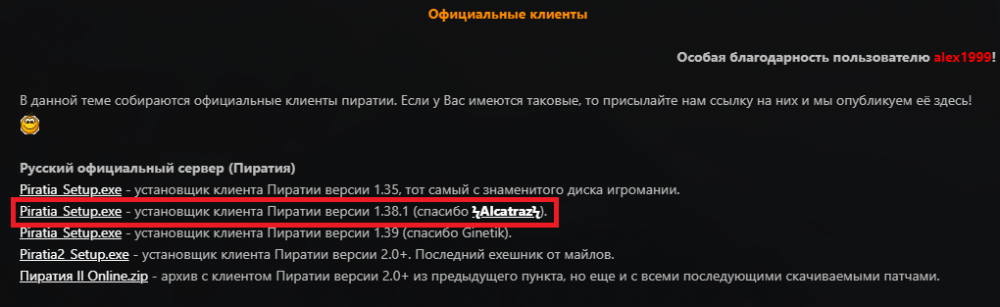

Скачайте выбранный дистрибутив (архив) и установите (распакуйте) его на Ваш диск. Перейдите в корневую директорию игрового клиента и создайте там .bat-файл с названием **start.bat**. Он будет необходим для запуска клиента в обход программы автообновления.

```
start system\Game.exe startgame
```

~~Затем скачайте программу IP Changer, с помощью которой нужно задать игровому клиенту IP-адрес для подключения к серверу.~~

Поместите IPChanger.exe в корневую директорию игрового клиента и запустите. В поля ввода текста **"Server Name**" (**1**) и "**Server Region**" (**2**) введите название Вашего сервера и регион соответственно. В поле "**Server Address**" (**3**) укажите IP-адрес игрового сервера, через который клиент будет к нему подключаться. Выпадающий список "**Client Version**" оставьте без изменений. Нажмите кнопку "**ОК**" (**4**) и после сообщения "**Address of server was successfully changed!**" закройте программу.

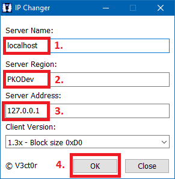

Первичная настройка клиента завершена. Для подключения к серверу необходим игровой аккаунт, который можно создать с помощью специальной программы.

Скачайте и запустите программу **Создать учетную запись**. Нажмите кнопку "**Настройки**" (**1**) на главной форме приложения. В окне "Настройки" укажите адрес или имя экземпляра Microsoft SQL Server (**1**), отметьте флажок "**Использовать проверку подлинности Windows**" и проверьте подключение (**3**). При успешном подключении к Microsoft SQL Server нажмите кнопку "**ОК**" (**4**).

Далее введите желаемые логин (**2**) и пароль (**3**) для новой учетной записи, а также выберите уровень доступа к системе (**4**). После заполнения всех полей нажмите кнопку "**Создать**" (**5**). Вы увидите сообщение о том, что учетная запись была успешно создана.

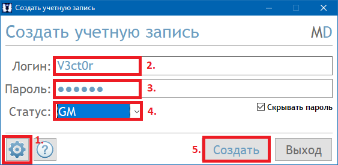

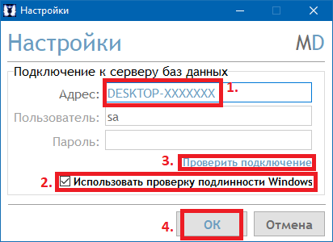

Запустите игровой клиент с помощью .bat-файла **start.bat** и подключитесь к серверу используя созданную учетную запись. После успешного входа в учетную запись, создайте нового персонажа и убедитесь что создание персонажей работает исправно.

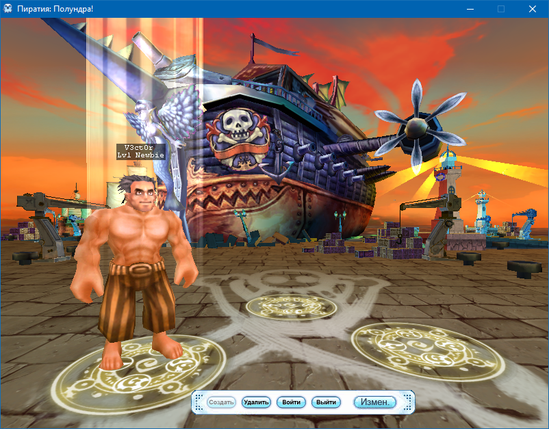

Войдите вновь созданным персонажем в игровой мир.

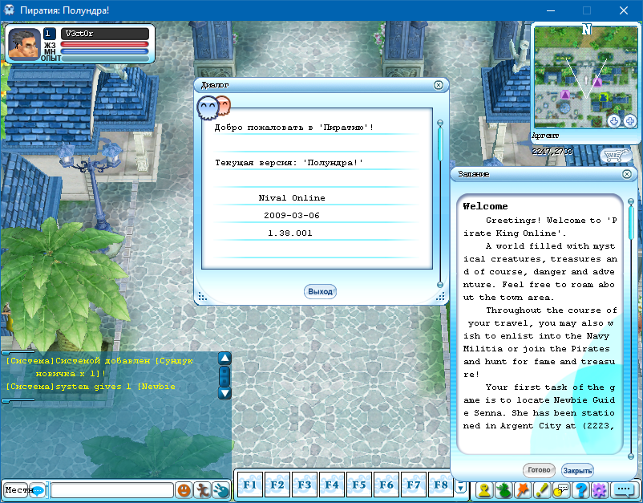

На этом этапе задача установки игрового сервера выполнена, и гайд подходит к своему логическому завершению, но в процессе Вы могли столкнуться с различными ошибками. В следующем разделе будут рассмотрены самые распространенные ошибки сервера и клиента, а также методы их устранения.

## 9. Распространенные ошибки и их исправление

В процессе установки сервера и подключения к игровому миру могут возникнуть различные ошибки. Далее рассмотрим самые распространенные и исправим их.


### 9.1 GameServer.exe сразу закрывается после запуска

Заполните все данные для подключения к Microsoft SQL Server в конфигурационном файле GameServer.cfg (секция DB).

```
[DB]
db_ip =
db_usr =
db_pass =
```

### 9.2 Ошибки GameServer "Database [GameDB] Connect Failed!", GroupServer "Unable to connect database", AccountServer "Main database handler create failed, AccountServer hang!"

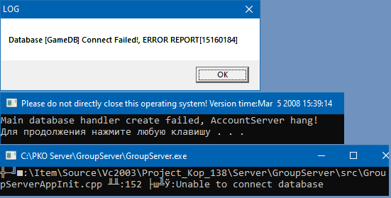

Данные ошибки говорят о том, что серверное программное обеспечение (GameServer, GroupServer, AccountServer) не может установить соединение с Microsoft SQL Server и получить доступ к соответствующим базам данных.

Возможные пути решения:

1. Проверьте, что Microsoft SQL Server **запущен** и Вы указали его **верный адрес или имя экземпляра** в конфигурационных файлах игрового сервера;
2. Проверьте, что в настройках безопасности Microsoft SQL Server Вы включили **проверку подлинности SQL Server и Windows** и перезапустили после этого SQL Server;
3. Убедитесь, что Вы используете **верные логин и пароль** пользователей для соответствующей базы данных в конфигурационных файлах игрового сервера. Пользователям баз данных должны быть выданы следующие права: **db_datareader**, **db_datawriter**, **db_ddladmin**, **public**. Пароли пользователей должны быть указаны в конфигурационных файлах в **зашифрованном виде**;
4. Убедитесь, что **названия баз данных совпадают** в Micrososft SQL Server и в конфигурационных файлах сервера, а так же в исполняемом файле GameServer.exe.

### 9.3 Ошибка GameServer "SubMap::LoadNpc: Obtain Map [<название локации>] ID fail!"

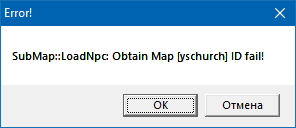

Данная ошибка может возникнуть в процессе загрузки локаций игрового мира при запуске экземпляра GameServer. Чтобы её исправить откройте файл **GameServer\resource\script\MisScript\ScriptDefine.lua** и добавьте в конец строку:

```
AddMap("<Кодовое название локации>", "<Игровое название локации>")
```

Например:

```
AddMap("yschurch", "Церковь")
```


### 9.4 Ошибка игрового клиента "Соединение прервано"

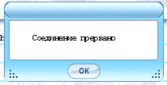

Такая ошибка возникает в случае, когда игровой клиент не может установить сетевое соединение с сервером.

Возможные пути решения:

1. Проверьте, что GateServer запущен. Если Вы подключаетесь к серверу через сеть Интернет, то **проверьте доступность** GateServer. Внешний порт игрового сервера (по умолчанию **1973**) должен быть **открыт**, а в конфигурационном файле GateServer.cfg должен быть указан **соответствующий внешний IP-адрес** (**0.0.0.0** или адрес выделенного сервера). Внешний IP-адрес сервера должен быть **публичным** ("белым");
2. Убедитесь, что игровой клиент настроен на **верный адрес игрового сервера**: с помощью программы IPChanger (а также иных способов настройки клиента) указан **верный IP-адрес** GateServer, а в Game.exe "зашит" **верный порт** GateServer (по умолчанию 1973). Чтобы убедиться в последнем, можно взять Game.exe из официального русского клиента без каких-либо модификаций, либо использовать специальную программу;
3. Соединению клиента с сервером могут препятствовать различные **программы-фаерволы**, **брандмауэр Windows**, а также **сетевые маршрутизаторы** (роутеры), в которых не был проброшен внешний порт GateServer на компьютер с игровым сервером.

### 9.5 Ошибка игрового клиента "Account server has encountered a malfunction"

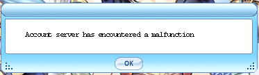

Запустите AccountServer и убедитесь что к нему успешно подключился GroupServer.

### 9.6 Ошибка игрового клиента "Discovered exceptional line error on GateServer"

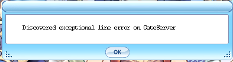

Запустите GroupServer и убедитесь что к нему успешно подключился GateServer.

### 9.7 Ошибка игрового клиента "Неверная версия игры"

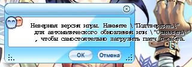

Убедитесь, что версии в конфигурационном файле GateServer.cfg (секция Main, параметр Version) и в Game.exe совпадают. Обычно в Game.exe "зашита" версия 136. Узнать версию Game.exe можно с помощью ~~специальной программы на нашем форуме~~.

### 9.8 Ошибка игрового клиента "illegal birth place" при создании персонажа

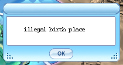

Откройте файл игрового клиента **Клиент\scripts\table\StringSet.txt** и замените строки:

```
[39]	"Аргент"
[40]	"Шайтан"
[41]	"Ледынь"
```

на:

```
[39]	"Argent City"
[40]	"Shaitan City"
[41]	"Icicle Castle"
```

Значения **Argent City**, **Shaitan City** и **Icicle Castle** определяются соответствующими значениями в конфигурационном файле GroupServer.cfg игрового сервера.

```
[bird]
Argent City = garner
Shaitan City = magicsea
Icicle Castle = darkblue
```

### 9.9 Ошибка игрового клиента "target map cannot be reached" при входе в игровой мир

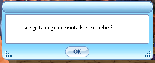

Выбранный персонаж находится на локации, **которая не запущена на сервере**. Запустите все экземпляры **GameServer** с полным набором локаций и убедитесь, что в каждом служебном окне текущего экземпляра GameServer отображается успешно загруженный список карт игрового мира (список **Map List**).

---

Если вы столкнулись с проблемой, которой нет в рассмотренном выше списке ошибок, то воспользуйтесь разделом "Пиратия: Помощь", в котором Вам придут на помощь более опытные администраторы и разработчики серверов Пиратии. Также за много лет на нашем форуме накоплен большой пласт опыта Ваших предшественников, поэтому целесообразно воспользоваться поиском по форуму: с большой долей вероятности Ваша проблема уже обсуждалась и решена в прошлом.

Благодарю Вас за внимание и надеюсь, что статья действительно была Вам интересна и помогла в установке сервера! Я был рад поделиться с Вами своим опытом.