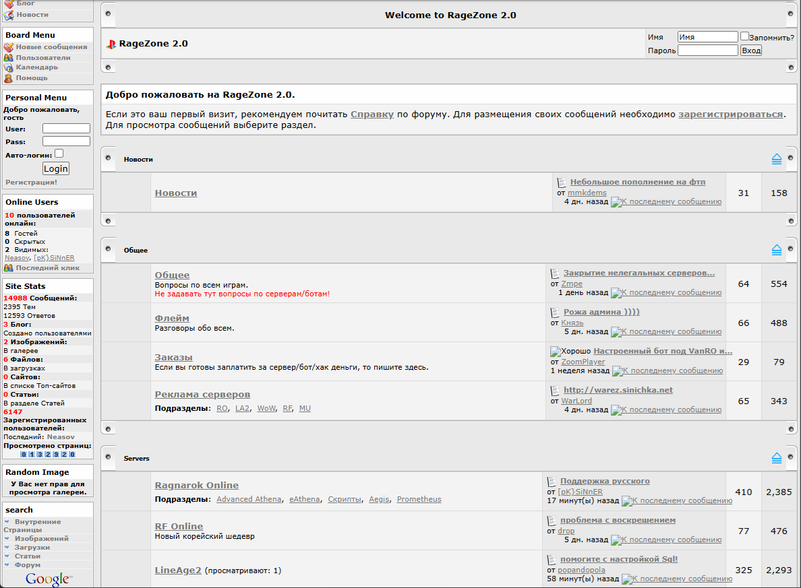
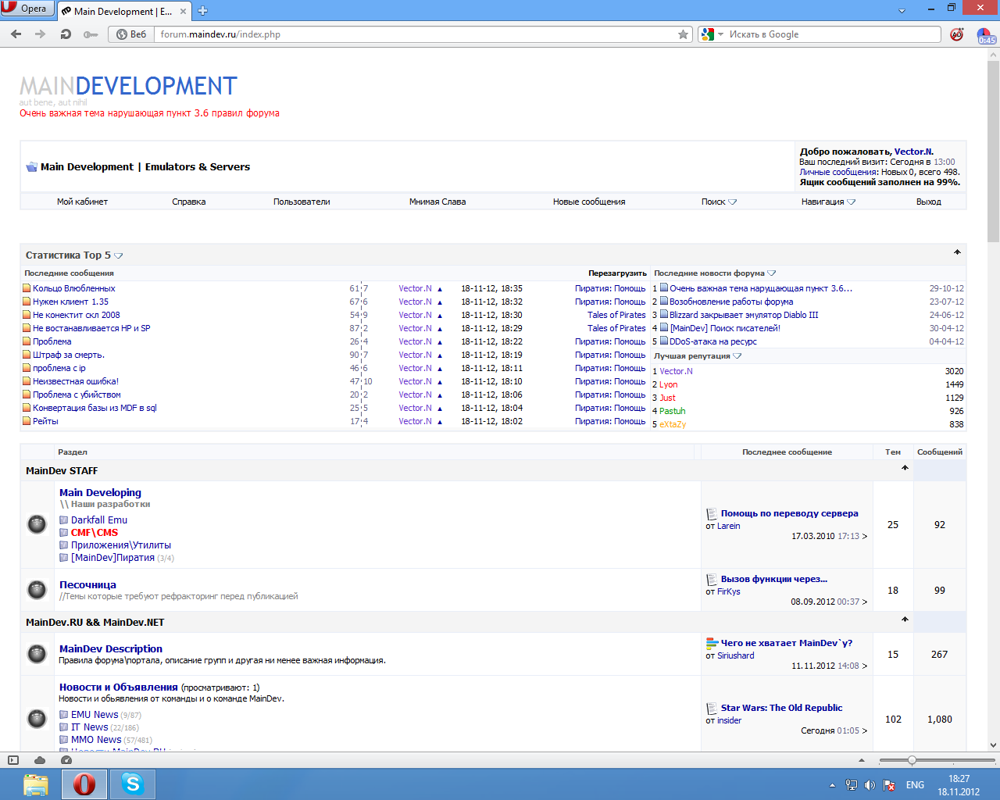
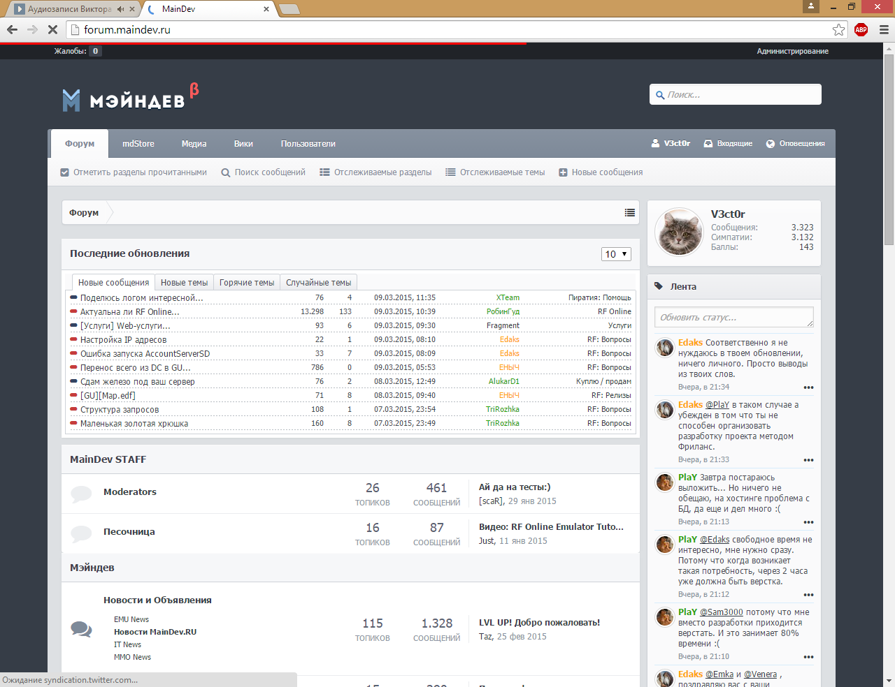
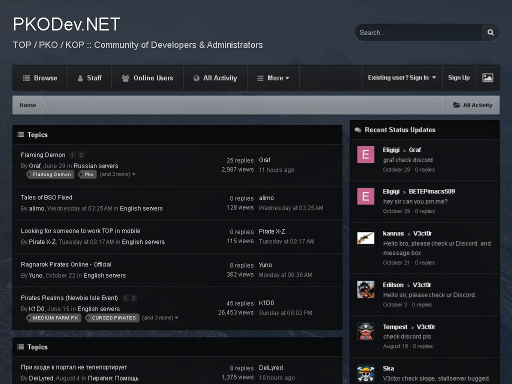

# Добро пожаловать на форум PKODev2.NET!

Привет, дорогой пользователь!

Рады тебя видеть на форуме **PKODev2.NET**!

Наш форум посвящен разработке и администрированию игровых проектов (серверов) MMORPG-игры "**Пиратия Online**" (так же известной как **Tales of Pirates**, **Pirate King Online**, **King of Pirates** и **XHDW**). PKODev2.NET позиционируется как технический форум, но мы всегда открыты и для игроков.

## Цель и миссия форума

**Целью форума** является объединение увлеченных и горящих "Пиратией" энтузиастов в большое и дружное **Комьюнити**, которое будет продолжать поддерживать жизнь данной игры. Дело в том, что "Пиратия" вышла в далеком 2004 году, и на сегодняшний день у неё уже не осталось работающих официальных серверов, на которые можно было бы зайти и поиграть. Многим игра запомнилась своим простым, но неординарным геймплеем и стилизованной графикой. Пожалуй, игру всего точнее можно охарактеризовать как ламповую. Таким образом, **Миссия форума** — подарить людям со всего мира возможность вновь пережить тот захватыющий опыт и вновь испытать те яркие эмоции, ведь для большинства игроков пик жизненного цикла игры пришелся на их детство.

Форум PKODev2.NET (или PKODev++, где "++" — в программировании оператор инкремента или увеличения на единицу) является преемником форума **PKODev.NET** и ставит перед собой важную **задачу по сохранению знаний и опыта**, накопленных за долгие годы работы предшественника.

**Главный вектор развития Сообщества сегодня** — разработка исходных кодов сервера и клиента, и проектов на их основе. Вместе с тем будет продолжаться поддержка (в т.ч. в виде модов) серверных сборок и клиентов на основе легаси-файлов (исполняемых .exe-файлов сервера и клиента, когда-то давно скомпилированных разработчиками игры).

Отметим, что форум PKODev2.NET представляет собой некоммерческий проект, не ставит перед собой задачи извлечения какой-либо материальной выгоды и существует исключительно за счёт энтузиазма своих пользователей.

## Что есть на форуме

Форум структурирован и поделен на специализированные разделы для удобства пользователей. В разделах форума представлены интересные **статьи на тему разработки и администрирования** сервера "Пиратии", **серверные сборки**, **игровые клиенты**, **исходные коды**, полезные **скрипты и программы**, **модификации**, **веб-сайты** и многое другое. У каждого из разделов есть описание, которое поможет понять назначение раздела и тематику его материалов.

Особое внимание хотим обратить на разделы "**Пиратия: Помощь**" и "**Questions & Help**" — в них активно ведется обсуждение вопросов и технических аспектов игры, с которыми Комьюнити постоянно сталкивается в ходе своей деятельности. Друзья, если у вас появляются вопросы, какие-либо сложности или проблемы то, пожалуйста, не стесняйтесь обращаться к упомянутым разделам!

PKODev2.NET — **международный** форум. Здесь вы можете познакомиться и пообщаться с единомышленниками из многих стран. В основном, общение происходит на русском и английском языках. Все это дает возможность скооперироваться и поучаствовать в реализации
совместных проектов.

## История форума

У форума довольно богатая история, которая берет свое начало с 2008 года. В то время работал сайт **ragezone.ru** — это был форум на тематику разработки серверов различных MMORPG-игр, таких как Ragnarok Online, RF Online, LineAge2, World of Warcraft и Mu online. 

*Сайт ragezone.ru*

Кроме больших разделов вышеупомянутых игр, на форуме присутствовал раздел "Неизвестные игры". Именно в этом разделе появилась тема, из которой впоследствии появился наш форум. К сожалению, история не сохранила её названия, но достоверно известно, что в ней обсуждались самые первые вопросы по установке сервера "Пиратии". Через некоторое время тема разрослась до десятков постов, а потом в "Неизвестных играх" появилась ещё одна тема и ещё... Но начался 2009 год, и в один день ragezone.ru перестал работать — при попытке зайти на сайт пользователей перенаправляло на другой форум, который назывался **maindev.ru**.

*Форум maindev.ru до 2015 года*

*Форум maindev.ru после 2015 года*

Форум maindev.ru только-только открылся и был совсем пуст, но зато на нём уже присутствовал полноценный раздел по нашей игре. Мы приступили к развитию раздела, и в результате он стал крупнейшим и самым посещаемым на форуме. Так продолжалось около 7 лет, пока в 2016 году maindev.ru, к сожалению, не стал работать с перебоями — даунтайм мог достигать нескольких месяцев. Такое положение вещей нас не устраивало, поэтому было принято решение перебазировать наш раздел на отдельный сайт, чтобы ни от кого не зависеть и иметь возможность оперативно решать технические вопросы по части функционирования форума. Так был открыт форум **PKODev.NET**, который уже полностью был посвящен только игре "Пиратия".

*Форум PKODev.NET*

Вскоре maindev.ru прекратил своё существование. Примерно в то же время закрылся другой сайт аналогичной тематики — зарубежный serverdev.net. Члены зарубежного Комьюнити начали посещать PKODev.NET и на форуме появился англоязычный раздел. Вспоследствии форум произвёл большое количество знаний, опыта и разработок. Говорят, что история развивается по спирали, и через 9 лет работы PKODev.NET постигла та же участь, что и maindev.ru — в мае 2025 года форум перестал работать. Итак, спустя многие годы и ряд событий появляется новая итерация форума — PKODev2.NET, а Сообщество администраторов и разработчиков игровых серверов "Пиратии Online" продолжает существовать.

---

Если у вас остались вопросы по форуму PKODev.NET, то, пожалуйста, задавайте их в этой теме!

Добро пожаловать на форум PKODev2.NET!