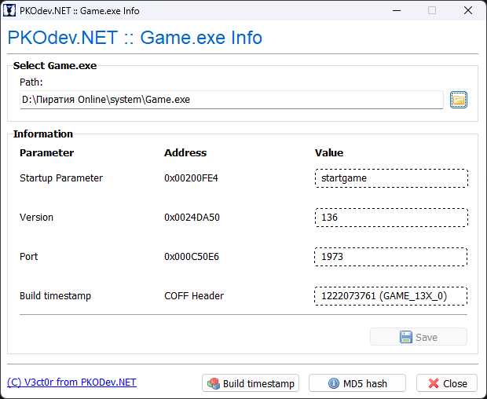

# Game.exe Info — Программа для просмотра информации о Game.exe

С помощью программы "**Game.exe Info**" вы можете просматривать и редактировать некоторые параметры в исполняемом файле игрового клиента (Game.exe) **официальных версий 1.3x**, необходимые для его запуска и подключения к серверу, а так же работы модов:

* Параметр запуска ("startgame") Game.exe;
* Сетевой TCP-порт сервера;
* Версию игры, которая передается в пакете аутентификации при подключении к серверу;
* Время сборки и обозначение Game.exe — эта информация нужна загрузчику модов для определения поддерживаемых модов.

**Поддерживаемые версии Game.exe:**
| № | Название | ID | Обозначение | Метка времени сборки|
| :--- | :--- | :--- | :--- | :--- |
| 1. | Game.exe | 3 | GAME_13X_0 | 1222073761 |
| 2. | Game.exe | 4 | GAME_13X_1 | 1243412597 |
| 3. | Game.exe | 5 | GAME_13X_2 | 1252912474 |
| 4. | Game.exe | 6 | GAME_13X_3 | 1244511158 |
| 5. | Game.exe | 7 | GAME_13X_4 | 1585009030 |
| 6. | Game.exe | 8 | GAME_13X_5 | 1207214236 |

Как пользоваться программой:
1. Скачайте архив "**GameInfo.zip**" по ссылке внизу темы, распакуйте его в любом удобном месте на диске и перейдите в директорию "**GameInfo**";
2. Запустите файл **GameInfo.exe** — появится главная форма приложения. Выберите требуемый файл Game.exe с помощью кнопки "**Browse...**" ();
3. Если выбранный Game.exe поддерживается программой (см. таблицу выше) и доступен для чтения/записи, то на форме появится группа полей "**Information**". В противном случае отобразится соответствующее сообщение об ошибке;
4. В группе полей "**Information**" доступна следующая информация для просмотра:
    * **Параметр запуска** — поле "**Value**" строки "**Startup Parameter**";
    * **Версия игры** — поле "**Value**" строки "**Version**";
    * **Порт сервера** — поле "**Value**" строки "**Port**";
    * **Время сборки и обозначение Game.exe** — поле "**Value**" строки "**Build timestamp**";
5. При необходимости, вы можете изменить **параметр запуска**, **версию игры** и **порт сервера** в выбранном Game.exe — для этого отредактируйте значения в полях "**Value**" для соответствующих строк и нажмите кнопку "**Save**";
6. Дополнительно, вы можете получить **MD5‑хэш** или **метку времени сборки** любого .exe‑файла, нажав на кнопки "**MD5 hash**" или "**Build Timestamp**" соответственно, и выбрав нужный файл в появившемся диалоге;
7. Нажмите на кнопку "**Close**" для выхода из программы.

---

[Скачать (Google Диск)](https://drive.google.com/file/d/1TI5kY8pKj7aHukHb5G-TkrWZvQx324C7)