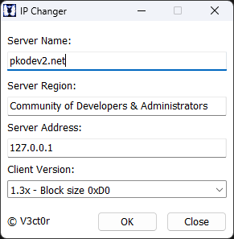

# IPChanger — Программа для смены адреса сервера

Программа предназначена для быстрой смены IP-адреса сервера в игровом клиенте.

**Поддерживаются следующие клиенты:**
* Версия 1.3x — размер блока в ServerSet.bin равен 0xD0 (208 байт);
* Версия 2.x — размер блока в ServerSet.bin 0x01E4 (484 байта).

**Как пользоваться:**
1. Скачайте программу "**IPChanger.exe**" по ссылке внизу темы и поместите её в корневую директорию игрового клиента;
2. Если версия клиента поддерживается программой, то в поле "**Client Version**" будет автоматически выбрана версия — **1.3x** или **2.x** для клиентов версий 1.3x и 2.x соответственно;
3. В поле "**Server Name**" введите название сервера, которое игрок увидит на странице "**Серверы**" при входе в игру;
4. В поле "**Server Region**" введите название сервера, которое игрок увидит на странице "**Область**" при входе в игру;
5. В поле "**Server Address**" введите IP-адрес сервера, к которому клиент должен подключаться;
6. Нажмите кнопку "**OK**". В случае, если адрес сервера был успешно изменен, вы увидите следующее сообщение: "**Address of server was successfully changed!**"

**Примечания:**
* После смены адреса в клиенте версии **2.x**, необходимо зашифровать **ServerSet.bin** с помощью программы **EncDecTool**;
* Для подключения клиента к серверу также необходим сетевой TCP-порт. Как правило, это **1973**, и его обычно не требуется изменять в клиенте. Если ваш сервер использует нестандартный порт, например, 2715, то его нужно указать в Game.exe. Это можно сделать с помощью программы [Game.exe Info](https://github.com/V3ct0r1024/pkodev2.forum/blob/main/ru/%D0%A0%D0%B5%D0%BB%D0%B8%D0%B7%D1%8B/%D0%9A%D0%BB%D0%B8%D0%B5%D0%BD%D1%82/Game.exe%20Info%20-%20%D0%9F%D1%80%D0%BE%D0%B3%D1%80%D0%B0%D0%BC%D0%BC%D0%B0%20%D0%B4%D0%BB%D1%8F%20%D0%BF%D1%80%D0%BE%D1%81%D0%BC%D0%BE%D1%82%D1%80%D0%B0%20%D0%B8%D0%BD%D1%84%D0%BE%D1%80%D0%BC%D0%B0%D1%86%D0%B8%D0%B8%20%D0%BE%20Game.exe/Game.exe%20Info%20-%20%D0%9F%D1%80%D0%BE%D0%B3%D1%80%D0%B0%D0%BC%D0%BC%D0%B0%20%D0%B4%D0%BB%D1%8F%20%D0%BF%D1%80%D0%BE%D1%81%D0%BC%D0%BE%D1%82%D1%80%D0%B0%20%D0%B8%D0%BD%D1%84%D0%BE%D1%80%D0%BC%D0%B0%D1%86%D0%B8%D0%B8%20%D0%BE%20Game.exe.md).

---

[Скачать (Google Диск)](https://drive.google.com/file/d/1tZR45x-uEEJnEPngMmHCHTcVJXV4U4s5)