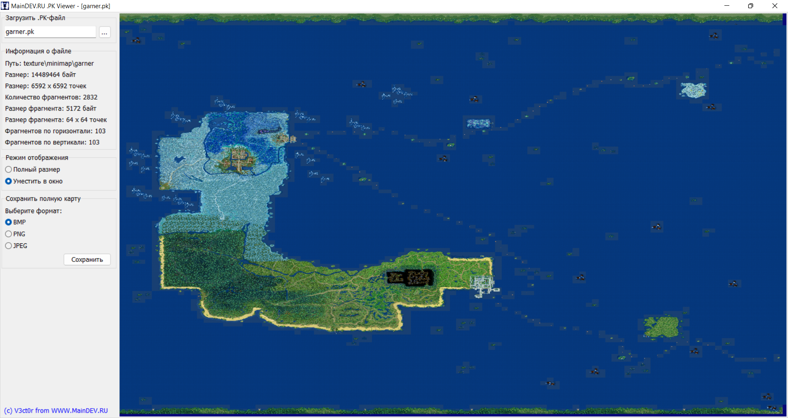
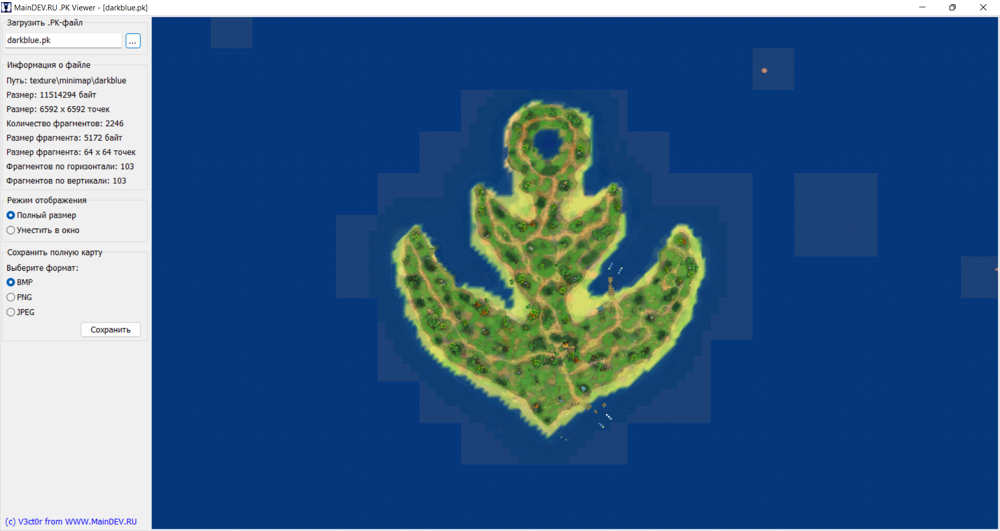
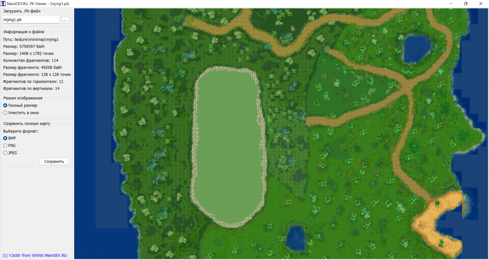

# PK Viewer — Программа для просмотра карт местности

Игровой клиент "Пиратии" хранит миникарты и полные карты местности в специальных файлах с расширением **.pk**. Эти файлы расположены в директории "**\Пиратия Online\texture\minimap**", например, "**\Пиратия Online\texture\minimap\garner\garner.pk**" — миникарта для континента "Аскарон".

Файл формата .pk представляет собой архив .bmp-изображений и заголовок, в котором записана последовательность отрисовки изображений на миникарте. Каждое изображение — это скриншот небольшой области игровой сцены (рельеф местности и объекты), по которой перемещаются игроки в ходе игры. В целях оптимизации размера .pk-файла в архив не включаются изображения, на которых отображено только море. .pk-файлы генерируются игровым клиентом в режиме редактора карт (startgame editor).

Программа **PK Viewer** позволяет просматривать полные карты местности из .pk-файлов и экспортировать их в растровые изображения форматов .bmp, .png и .jpeg.

**Как пользоваться программой:**
1. Скачайте программу "**PK Viewer.exe**" по ссылке внизу темы и запустите её;
2. На панели "**Загрузить .PK-файл**" нажмите кнопку "**...**" и выберите нужный файл в формате **.pk**;
3. После загрузки .pk-файла появятся панели "**Информация о файле**", "**Режим отображения**" и "**Сохранить полную карту**", а в центральной области окна программы отобразится непосредственно миникарта, содержащаяся в загруженном файле;
4. При режиме отображения "**Полный размер**" (выбирается по умолчанию) для прокрутки карты по вертикали и горизонтали зажмите на области карты левую кнопку мыши и переместите мышь. При режиме отображения "**Уместить окно**" карта местности полностью вписывается в окно программы;
5. При помощи панели "**Сохранить полную карту**" вы можете сохранить загруженную карту в виде растрового изображения. Для этого выберите нужный формат (**BMP**, **PNG** или **JPEG**) и нажмите кнопку "**Сохранить**". После успешного экспорта карты должно появиться сообщение: "**Полная карта была успешно сохранена в файл <название_файла>.<формат>!**"

---

[Скачать (Google Диск)](https://drive.google.com/file/d/1QPJWvV5KHFdNeIZ-IP3Kn56GXFRyIXIb)
