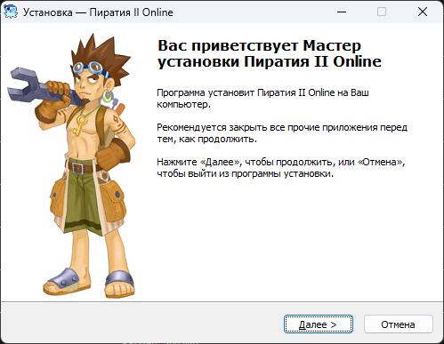

# Официальные клиенты

Друзья, привет!

В данной теме выкладываются официальные клиенты **Пиратии**, **Tales of Pirates**, **Pirate King Online** и **XHDW**. Если у вас имеются такие официальные клиенты, то присылайте нам ссылку на них, и мы опубликуем её здесь!

## Русский официальный сервер (Пиратия)

| №      | Название | Версия | Ссылка     | Описание|
| :---        |    :---   | :---   |     :--- | :--- |
| 1. | Piratia_Setup.exe | 1.35 | [Скачать](https://disk.yandex.ru/d/c4hDnMhXkJF3Q) | Установщик клиента Пиратии версии 1.35, тот самый с знаменитого диска игромании. |
| 2. | Piratia_Setup.exe | 1.38 | [Скачать](https://disk.yandex.ru/d/Lezw_FPt3afJnM) | Установщик клиента Пиратии версии 1.38.1.
| 3. | Piratia2_Setup.exe | 2.0+ | [Скачать](https://disk.yandex.ru/d/4vOxomRukJGAt) | Установщик клиента Пиратии версии 2.0+. Последний .ехе-шник от майлов.
| 4. | Пиратия II Online.zip | 2.0+ | [Скачать](https://yadi.sk/d/z8iwL1WlkJGTX) | Архив c клиентом Пиратии версии 2.0+ из предыдущего пункта, но еще и со всеми последующими скачиваемыми патчами.

## Tales of Pirates

| №      | Название | Версия | Ссылка     | Описание|
| :---        |    :---   | :---   |     :--- | :--- |
| 1. | top2_setup_1.0.70.exe | 2.0+ | [Скачать](https://disk.yandex.ru/d/gRvEh1E9pGMhM) | Установщик клиента Tales of Pirates II. Последний ехешник от IGG. |

## Pirate King Online

| №      | Название | Версия | Ссылка     | Описание|
| :---        |    :---   | :---   |     :--- | :--- |
| 1. | PKOII.zip  | 2.0+ | [Скачать](https://disk.yandex.ru/d/XOpg-IPSkJHX2) | Архив с клиентом PKO версии 2.0+. Какой-то "страшный" архив с PKO-клиентом, взят откуда-то из Интернета. Однако, полностью совместим с гулящими в паблике серверными файлами версии 2.5, работает фича с просмотром экипировки другого игрока и т.д., чем и ценен. |

## XHDW

| №      | Название | Версия | Ссылка     | Описание|
| :---        |    :---   | :---   |     :--- | :--- |
| 1. | XHDW_3.0.1_Setup.exe | 3.0+ | [Скачать](https://disk.yandex.ru/d/U50ZN9BvkJHG9) | Установщик клиента XHDW версии 3.0+. Сам установщик битый и не устанавливается до конца привычным способом, однако вскрывается простым 7-Zip, после чего совершенно безвозмездно отдает все свои ресурсы. |

---

Большая благодарность следующим людям за ссылки на клиенты выше: **alex1999**, **Alсаtrаz** и другим! 