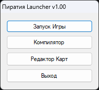

# Пиратия Launcher — Программа для запуска игрового клиента

Простая программа для удобного запуска клиента — с её помощью можно запускать клиент в **штатном режиме** (startgame), в **режиме компилятора .txt таблиц** (table_bin) и в **режиме редактора карт** (startgame editor). 

**Как пользоваться:**
1. Скачайте программу "**Пиратия Launcher.exe**" по ссылке внизу темы и поместите её в корневую директорию игрового клиента;
2. Запустите программу и нажмите соответствующую кнопку, чтобы запустить клиент в необходимом режиме;
3. После завершения работы с программой нажмите кнопку "**Выход**".

---

Автор, к сожалению, неизвестен — благодарю его за программу и прошу связаться со мной.

[Скачать (Google Диск)](https://drive.google.com/file/d/1YRrOdsf_zyPjBLkIqJJ029bF0c6XUrdV)