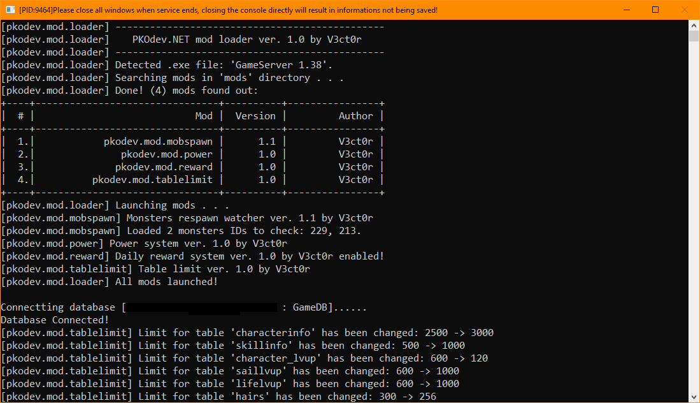
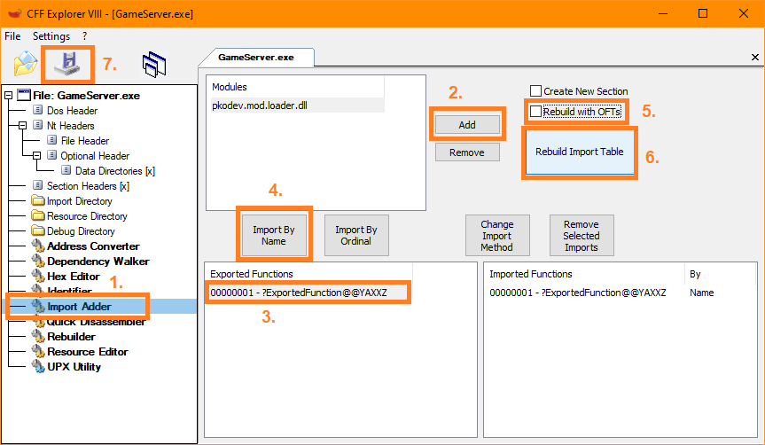
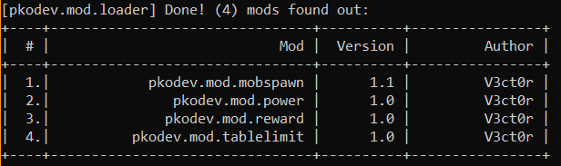
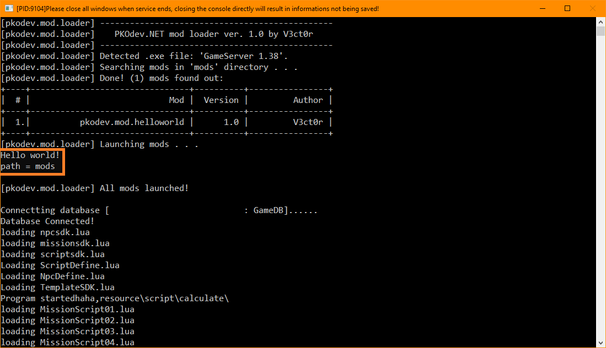

# PKODev.NET Mod Loader — Загрузчик модификаций для сервера и клиента




## Проблематика и мотивация

Многим разработчикам и администраторам серверов Пиратии в нашем Cообществе известно, что функциональность клиента и сервера можно изменять и дополнять так называемыми **модами** (аддонами, плагинами, патчами). 

Приведем некоторые примеры таких модов:
1. Исправление SQL-инъекций в AccountServer.exe и GroupServer.exe;
2. Увеличение лимитов для .txt/.bin файлов сервера и клиента (ItemInfo, CharacterInfo, SkillInfo и др.);
3. Обработка сообщений в канал местного чата с помощью Lua-функции HandleChat();
4. Трансформация персонажей с помощью Lua-функции TransformCha();
5. Панель наложенных на персонажа игрока эффектов;
6. Отображение уровня ЖЗ и МН под персонажами и монстрами;
7. ... и многие другие.

Таким образом, с помощью модов можно исправлять критические баги и уязвимости, изменять настройки сервера и клиента, добавлять новый функционал и игровые возможности.

Изначально появление модов было вызвано отсутствием в открытом доступе исходных кодов клиента и сервера: разработчикам ничего не оставалось, кроме того, как редактировать исполняемые .exe-файлы, развивая и применяя навыки реверс-инжиниринга. После публикации "исходников" популярность модов по-прежнему остается на высоком уровне.

Этому способствует ряд причин:
1. Низкое качество полученных исходных кодов, отсутствие опыта их использования. Чтобы ими пользоваться, администратору нужно обладать широкими знаниями языка программирования C++, разбираться в клиент-серверной архитектуре, понимать как устроены сервер и клиент "Пиратии". Исходные коды требуют длительного изучения и исследования на предмет багов и уязвимостей, включая полноценный процесс тестирования (QA). Иными словами, у исходных кодов очень высокий порог вхождения;
2. Существующие официальные сборки сервера и клиента в полной мере удовлетворяют требованиям большинства администраторов и игроков, более того, их работоспособность и надежность подтверждена годами практического применения. Для них было создано множество программ, скриптов и модов, которые могут быть несовместимы с исполняемыми файлами сервера и клиента, собранными из исходных кодов;
3. Изучение исходных кодов позволяет лучше понять устройство исполняемых файлов сервера и клиента "Пиратии". Такие полученные знания делают возможным создание модов повышенной сложности.

Администраторы и разработчики при реализации своих игровых проектов могут пойти по двум путям: использовать старые, официальные сборки сервера и клиента (т.н. "легаси"), и изменять их функционал с помощью новых модов, либо развиваться в направлевпрочемнии разработки исходных кодов. Как должно быть уже понятно, в данной теме обсуждается первый подход.

В настоящий момент разработка модов связана с некоторыми трудностями:
1. В нашем Cообществе отсутствует четкий стандарт и культура создания модов. Кто-то внедряет код непосредственно в исполняемые .exe-файлы сервера и клиента методом "патчинга", другие предпочитают писать DLL-библиотеки и вручную подключать их к исполняемым .exe-файлам. Некоторые моды могут конфликтовать друг с другом, что приводит к ошибкам и трудноуловимым багам;
2. Как следствие, установка модов сопряжена с определенными трудностями: например, как перенести мод из одного GameServer.exe в другой? Каждый раз необходимо заниматься редактированием ("патчингом") исполняемых .exe файлов, а для этого нужно обладать специальными знаниями и навыками. Если моды выполнены в виде DLL-библиотек, то каждый мод необходимо вручную вносить в таблицу импорта исполняемого .exe файла. Более того, .exe-файл становится зависим от DLL-библиотеки мода и не запустится при отсутствуии последней. Все это неудобно, отнимает много времени, увеличивает вероятность совершения ошибок в процессе установки модов и в результате приводит к появлению багов; 
3. Существует некоторое множество версий GameServer.exe и Game.exe (остальные серверные исполняемые .exe-файлы пока не принимаем во внимание), которые имеют различную двоичную структуру. Иными словами, разработанный мод для GameServer.exe версии 1.36 не будет работать с GameServer.exe версии 1.38 — вам необходимо разрабатывать мод под конкретный .exe-файл. Яркий пример — адреса лимитов для .txt/.bin: многие разработчики заметили, что они различаются для разных Game.exe и GameServer.exe. Вследствие этого пункта возникает путаница с версиями исполняемых .exe-файлов и соответствующих версий модов для них.

Исходя из всего вышесказанного, было принято решение разработать систему, которая исправит текущее положение вещей в отношении модов, упростит их создание и использование — **Загрузчик модификаций для сервера и клиента**.

## Загрузчик модификаций

Загрузчик модификаций представляет собой DLL-библиотеку, которая единоразово подключается к целевому исполняемому .exe-файлу сервера или клиента. Под целевым исполняемым .exe-файлом подразумевается, например, Game.exe или GameServer.exe, т.е. .exe-файл, к которому необходимо применить модификацию. Моды так же являются DLL-библиотеками, которые помещаются в определенную директорию и автоматически применяются загрузчиком модификаций при запуске сервера или клиента.

Загрузчик модификаций выполняет ряд задач:
1. Унификация процесса создания, установки и запуска модов;
2. Определение типа и версии исполняемого .exe-файла (Game.exe или GameServer.exe? Какой версии?), который подлежит модификации;
3. Поиск установленных модов, определение их версии и совместимости с целевым исполняемым .exe-файлом, подключение DLL-библиотек модов к исполняемому .exe-файлу клиента или сервера.

Перед запуском исполняемого .exe-файла сервера или клиента управление передаётся загрузчику модификаций. Загрузчик модификаций определяет тип и версию .exe-файла, к которому он привязан, и начинает процесс рекурсивного поиска DLL-библиотек в директории "mods" в корне директории сервера или клиента. Каждая найденная DLL-библиотека динамически подключается к процессу сервера или клиента, после чего загрузчик запрашивает у библиотеки информацию о моде, который в ней содержится: название мода, тип и версия целевого .exe-файла, версия мода, имя автора модификации. Если тип и версия целевого .exe-файла совпадают с данными целевого .exe-файла, полученными из DLL-библиотеки мода, то загрузчик даёт моду команду на активацию. Далее уже мод вносит изменения в код процесса исполняемого файла, тем самым осуществляя модификацию. Перед завершением процесса сервера или клиента управление снова передаётся загрузчику, который по очереди отключает от процесса все моды, корректно сохраняя их параметры и освобождая ресурсы.

Определение типа исполняемого файла (GameServer.exe, GroupServer.exe, AccountServer.exe, GateServer.exe или Game.exe) и его версии производится по метке времени компиляции (linker timestamp), которая записана в [COFF-заголовке](https://learn.microsoft.com/en-us/windows/win32/api/winnt/ns-winnt-image_file_header) каждого исполняемого файла.

Текущая версия загрузчика модификаций может работать с официальными 1.3x-версиями Game.exe (клиент) и GameServer.exe, GroupServer.exe, GateServer.exe (сервер), список которых приведён в таблице ниже:

| Название             | ID | Обозначение     | Метка времени |
|----------------------|----|-----------------|---------------|
| GameServer.exe 1.36  | 1  | GAMESERVER_136  | 1204708785    |
| GameServer.exe 1.38  | 2  | GAMESERVER_138  | 1204708785    |
| Game.exe             | 3  | GAME_13X_0      | 1222073761    |
| Game.exe             | 4  | GAME_13X_1      | 1243412597    |
| Game.exe             | 5  | GAME_13X_2      | 1252912474    |
| Game.exe             | 6  | GAME_13X_3      | 1244511158    |
| Game.exe             | 7  | GAME_13X_4      | 1585009030    |
| Game.exe             | 8  | GAME_13X_5      | 1207214236    |
| GateServer.exe 1.38  | 101| GATESERVER_138  | 1224838480    |
| GroupServer.exe 1.38 | 201| GROUPSERVER_138 | 1224838510    |

## Установка загрузчика модификаций



1. В корневой директории исполняемого .exe-файла, к которому необходимо подключить загрузчик модов, создайте папку с названием "**mods**". В этой папке будут храниться DLL-библиотеки модов. **Важно:** для **Game.exe** папка "mods" должна находиться в корневой директории игрового клиента, а не в папке "system";
2. Перейдите в [репозиторий проекта загрузчика модификаций на GitHub](https://github.com/V3ct0r1024/pkodev.mod.loader) и скачайте DLL-библиотеку **pkodev.mod.loader.dll** последней версии (можно найти в разделе **Releases**);
3. Откройте целевой исполняемый .exe-файл в программе [CFF Explorer](https://ntcore.com/explorer-suite/). Перейдите на вкладку "**Import adder**" (**1**);
4. Нажмите кнопку "**Add**" (**2**) и выберите файл **pkodev.mod.loader.dll**;
5. В списке "**Exported functions**" выберите "ExportedFunction" (**3**);
6. Нажмите кнопку "**Import By Name**" (**4**);
7. Снимите флажок "**Rebuild OFTs**" (**5**);
8. Нажмите кнопку "**Rebuild Import Table**" (**6**);
9. Сохраните файл (**7**).
10. Запустите исполняемый .exe-файл. В окне консоли\* вы должны увидеть похожее сообщение:

    ```
    [pkodev.mod.loader]   -----------------------------------------------
    [pkodev.mod.loader]    PKOdev.NET mod loader ver. 1.0 by V3ct0r
    [pkodev.mod.loader] -----------------------------------------------
    ```

    \* Если у исполняемого файла нет окна консоли, например, у Game.exe, то запустите его следующим образом:

    ```
    system\Game.exe startgame > output.txt 
    ```

    Теперь вывод в консоль будет перенаправлен в   текстовый файл **output.txt**.

## Установка модификаций

Чтобы установить мод, достаточно поместить его DLL-библиотеку в папку "**mods**". Для удобства каждый мод можно помещать в отдельную папку.

Пример организации структуры директории "mods" для сервера (GameServer.exe):

```
GameServer
├── GameServer.exe
├── pkodev.mod.loader.dll
└── mods
    ├── .disabled
    ├── .priority
    ├── pkodev.mod.example1.server.138.dll
    ├── pkodev.mod.example2
    │   └── pkodev.mod.example2.server.138.dll
    └── pkodev.mod.example3
        └── pkodev.mod.example3.server.138.dll
```

Пример организации структуры директории "mods" для клиента:

```
Пиратия Online
├── system
│   ├── Game.exe
│   └── pkodev.mod.loader.dll
└── mods
    ├── .disabled
    ├── .priority
    ├── pkodev.mod.example1.client.13x_0.dll
    ├── pkodev.mod.example2
    │   └── pkodev.mod.example2.client.13x_0.dll
    └── pkodev.mod.example3
        └── pkodev.mod.example3.client.13x_0.dll
```

После запуска исполняемого .exe-файла вы должны увидеть новый мод в списке загруженных модов:



## Удаление модификаций

Чтобы удалить мод, необходимо удалить его DLL-библиотеку из директории "**mods**".

## Временное отключение модификаций

Чтобы отменить загрузку тех или иных модов, создайте в корневой директории с модами (папка "mods") файл ".disabled" и запишите в него названия модов, которые необходимо временно отключить, с новой строки. Например:

```
// Файл: mods\.disabled
// Запишите ниже названия модов, которые необходимо отключить
pkodev.mod.fullmap
pkodev.mod.tablelimit
```

Таким образом, моды "pkodev.mod.fullmap" и "pkodev.mod.tablelimit" будут проигнорированы загрузчиком.

## Приоритет загрузки модификаций

Загрузчик модов позволяет загружать те или иные моды в указанном порядке. Для этого создайте в корневой директории с модами (папка "mods") файл ".priority" и запишите в него названия модов в порядке убывания приоритета. Моды, не записанные в данном файле, будут загружены после модов с приоритетом, в случайном порядке. Например:

```
// Файл mods\.priority
// Запишите ниже названия модов в порядке убывания приоритета загрузки
pkodev.mod.power
pkodev.mod.tablelimit
pkodev.mod.fullmap
```

Моды будут загружены в следующем порядке:

1. pkodev.mod.power;
2. pkodev.mod.tablelimit;
3. pkodev.mod.fullmap;
4. Далее - все остальные обнаруженные в папке "mods" моды в случайном порядке.

## Создание мода

Для того, чтобы мод мог быть загружен загрузчиком, он должен соответствовать следующим требованиям:

1. Название DLL-библиотеки мода должно быть вида:

    ```
    pkodev.mod.<название мода>.<client или server или   gate или group>.<обозначение версии .exe-файла>.dll
    ```

    Например:

    ```
    pkodev.mod.tablelimit.client.13x_0.dll
    pkodev.mod.mobspawn.server.138.dll
    ```

2. DLL-библиотека мода должна экспортировать 3 функции:

    * **void __cdecl GetModInformation(mod_info& info)**

        Заполнить структуру типа **mod_info**. Данная структура содержит основную информацию о моде: **название**, **версию**, **имя автора** и **ID типа и версии исполняемого .exe-файла**, для которого предназначен мод:

        ```
        struct mod_info
        {
             char name[128];           // Название мода
             char version[64];         // Версия мода
             char author[64];          // Имя автора
             unsigned int exe_version; // Тип и версия целевого .exe файла (см. таблицу выше)
        };
        ```

        Примеры значений полей:

        ```
        name = "pkodev.mod.example"
        version = "1.2"
        author = "V3ct0r"
        exe_version = 7
        ```

    * **void __cdecl Start(const char\* path)**

        Запустить мод и произвести модификацию процесса исполняемого файла сервера или клиента. В переменной **path** содержится путь до директории, в которой находится мод. В данной функции мод должен **выполнить свою инициализацию**, **загрузить необходимые настройки** и **произвести модификацию процесса исполняемого файла**.

    * **void __cdecl Stop()**

        Остановить мод. В данной функции мод должен **сохранить свои настройки**, **откатить модификацию процесса** (необязательно) и **освободить ресурсы**.

3. Тип и версия исполняемого файла, указанная в DLL-библиотеке мода (структура **modinfo**, поле **exe_version**), должны совпадать с типом и версией исполняемого файла, для которого он предназначен. Если загрузчик определил тип и версию исполняемого файла как **GameServer.exe 1.38** (**GAMESERVER_138**) с ID **2** (см. таблицу выше), то DLL-библиотека мода должна записывать в поле **exe_version** значение **2**.

## Пример разработки мода

Для разработки модов можно использовать любой язык программирования, поддерживающий создание DLL-библиотек. Я буду использовать язык **C++** и среду разработки **Visual Studio 2022 Community**.

В качестве примера создадим тестовый мод для **GameServer.exe версии 1.38 (ID: 2)**. Модификация будет выводить в консоль GameServer.exe сообщение "Hello world!" и путь до директории, в которой располагается DLL-библиотека мода.

1. Определим название мода, пусть оно будет:

    ```
    pkodev.mod.helloworld
    ```

    Тогда название DLL-библиотеки мода должно быть следующим (см. требования к названию DLL-библиотеки мода):

    ```
    pkodev.mod.helloworld.server.138.dll
    ```

2. Создадим проект динамически подключаемой библиотеки DLL с именем выходного .DLL-файла **pkodev.mod.helloworld.server.138.dll**;
3. Подключим к проекту файл с API загрузчика модов — [loader.h](https://github.com/V3ct0r1024/pkodev.mod.loader/blob/master/loader.h) (см. репозиторий проекта системы загрузки модификаций в конце темы);
4. Реализуем функцию **GetModInformation()**:

    ```
    void GetModInformation(mod_info& info)
    {
        strcpy_s(info.name, "pkodev.mod.helloworld");
        strcpy_s(info.version, "1.0");
        strcpy_s(info.author, "V3ct0r");
        info.exe_version = GAMESERVER_138;
    }
    ```

5) Реализуем функцию **Start()**:

    ```
    void Start(const char* path)
    {
        std::cout << "Hello world!\n"
                  << "path = " << path << '\n' << std::endl;
    }
    ```

6) Реализуем функцию **Stop()**:

    ```
    void Stop()
    {
    
    }
    ```

7) Выполним сборку проекта. В результате мы получим файл DLL-библиотеки мода **pkodev.mod.helloworld.server.138.dll**;
8) Устанавливаем и тестируем мод. В окне GameServer.exe мы должны увидеть сообщение **"Hello world!"** и путь до корневой директории мода:

    

## Ссылки

* [Репозиторий проекта PKODev.NET Mod Loader на GitHub](https://github.com/V3ct0r1024/pkodev.mod.loader)

---

Если у вас есть какие-либо вопросы или возникли проблемы, то смело спрашивайте в данной теме!
