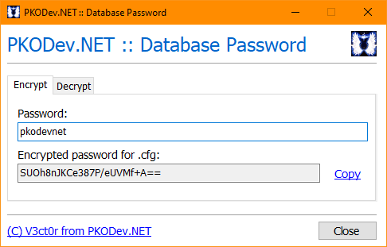
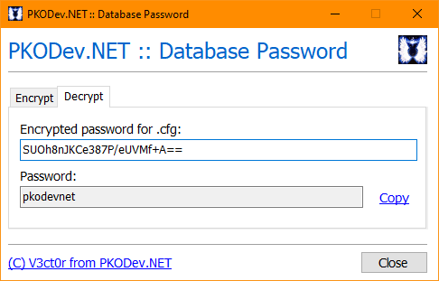

# Database Password — Программа для шифрования паролей в .cfg-файлах сервера

 

Для установления соединения с MSSQL-сервером и работы с ним, серверные исполняемые файлы (**AccountServer.exe**, **GroupServer.exe** и **GameServer.exe**) загружают адрес MSSQL-сервера и учетные данные пользователя базы данных из соответствующих **конфигурационных файлов (.cfg)**. При этом пароль пользователя шифруется особым способом с использованием алгоритмов **DES** и **Base64**.

Данная программа предназначена для шифрования и расшифрования паролей пользователя базы данных для указания в .cfg-файлах игрового сервера.

**Пример зашифрованного пароля для GameServer.cfg:**

```
[DB]
db_ip   = 127.0.0.1
db_usr  = PKODev_User
db_pass = SUOh8nJKCe387P/eUVMf+A==
```

**Как пользоваться программой**:
1. Скачайте программу "**pkodev.tool.dbpass.exe**" по ссылке внизу темы и запустите её;
2. **Шифрование пароля**: На вкладке "**Encrypt**" в поле "**Password**" введите желаемый пароль для шифрования. В поле "**Encrypted password for .cfg**" отобразится зашифрованный пароль. **Примечание**:  Максимальная длина пароля – **16 символов**. Данное ограничение вызвано величиной буфера в 32 байта для чтения зашифрованного пароля из конфигурационных файлов в серверных исполняемых файлах;
3. **Расшифрование пароля**: На вкладке "**Decrypt**" в поле "**Encrypted password for .cfg**" введите зашифрованный пароль. В поле "**Password**" отобразится расшифрованный пароль;
4. Нажмите кнопку "**Close**", чтобы завершить работу программой.

---

[Скачать (Google Диск)](https://drive.google.com/file/d/1pnY38zY7ilqPBjvIfNSiiN3k-osEytdL)
