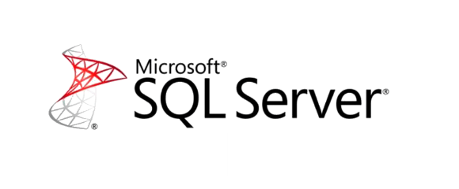

# Microsoft SQL Server Express Edition

> **Microsoft SQL Server** — система управления реляционными базами данных (РСУБД), разработанная корпорацией Microsoft. Основной используемый язык запросов — Transact-SQL, создан совместно Microsoft и Sybase. Transact-SQL является реализацией стандарта ANSI/ISO по структурированному языку запросов (SQL) с расширениями. Используется для работы с базами данных размером от персональных до крупных баз данных масштаба предприятия; конкурирует с другими СУБД в этом сегменте рынка.

> **Microsoft SQL Server Express Edition** — это версия реляционной системы управления базами данных 
Microsoft SQL Server
 от компании 
Microsoft
, которая распространяется бесплатно для скачивания, распространения и использования. Она предназначена специально для встроенных приложений и приложений меньшего масштаба. Продукт ведет свою историю от Microsoft Data Engine (MSDE), который поставлялся вместе с SQL Server 2000. Брендинг "Express Edition" используется с момента выпуска SQL Server 2005. SQL Server Express предлагает многие функции платных версий Microsoft SQL Server, но имеет ограничения, не подходящие для крупных проектов.

##### [Википедия - Свободная энциклопедия](https://ru.wikipedia.org/wiki/Microsoft_SQL_Server)

Бесплатная версия системы управления базами данных, которая необходима для работы сервера Пиратии. Несмотря на некоторые ограничения, подойдет для разработки и большинства игровых проектов.

[Скачать](https://www.microsoft.com/ru-ru/download/details.aspx?id=104781)