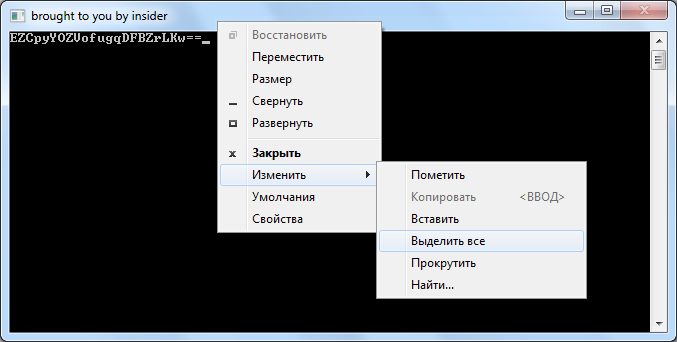

# Passgen by insider — Программа для шифрования паролей в .cfg-файлах сервера

Вам не нравится, что недобросовестный хостер рисует через **SQL Server Management Studio**?
Вам не нравится, что вы не можете открыть доступ к БД во внешку (для сайта или со-админов), потому что туда мигом слетятся "кулхацкеры" и нагадят?

Тогда эта тема для вас. Представляю вам пошаговую инструкцию по генерации паролей БД. Вернее, не так. Сама по себе данная утилита ничего не генерирует, она лишь шифрует ваш пароль в съедобный для .cfg файлов сервера формат. Итак, начнем.

Сперва скачиваем утилиту по данной ссылке: [passgen © by insider](https://drive.google.com/file/d/1b4U2-dFge9OQ6Wlobd69TTbZG3YjmHRz/view?usp=sharing)

Открываем файл **passgen.ini** и вписываем туда желаемый пароль (я буду объяснять на примере стандартного **Y87dc#$98**). **Внимание!** Длина пароля должна быть ровно 9 символов (ни больше, ни меньше):

```
pass=Y87dc#$98
```

Запускаем **passgen.exe** и получаем:



После того, как вы выбрали **Выделить все**, нажмите клавишу **Enter** и зашифрованный пароль попадет в буфер обмена:

```
EZCpyYOZVofugqDFBZrLKw==
```

---

**© insider** — оригинальная версия статьи с сайта **maindev.ru** от **13 декабря 2009**.
