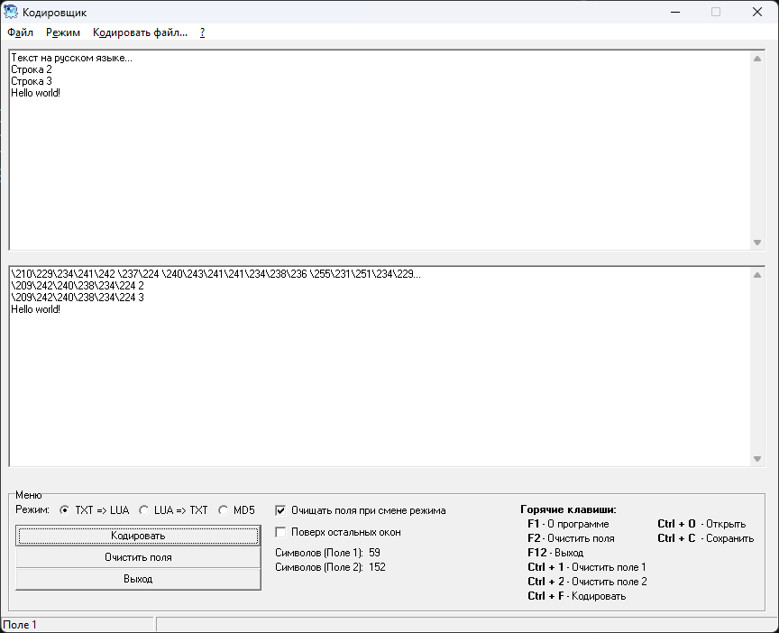

# Кодировщик — Русские символы в Lua-скриптах

Для избежания проблем с кодировкой при использовании русских символов в Lua-скриптах сервера и клиента рекомендуется кодировать русские символы — вместо непосредственно символов в строках указывать их числовой код с помощью escape-последовательностей. Например, символу '**А**' соответствует последовательность "**\192**", символу '**Б**' соответствует "**\193**" и так далее.

Чтобы автоматизировать процесс кодирования русских символов, а также удобно переводить escape-последовательности обратно в символы, была разработала программа "**Кодировщик**".

**Как пользоваться программой:**

1. Скачайте программу "**Coder 1.2.exe**" по ссылке внизу темы и запустите её;
2. Выберите режим:
    * **TXT => LUA**: Перевести русские символы в кодовое представление для использования в Lua-скриптах. Для этого введите текст, который необходимо закодировать, в верхнее многострочное поле ввода и нажмите кнопку "**Кодировать**". В нижнем многострочном поле ввода появится закодированный текст;
    * **LUA => TXT**: Перевести закодированный текст из Lua-скриптов в русские символы. Для этого введите текст, который необходимо раскодировать, в верхнее многострочное поле ввода и нажмите кнопку "**Декодировать**". В нижнем многострочном поле ввода появится раскодированный текст;
    * **MD5**: Дополнительно программа может вычислять MD5-хэши строк. Введите строку, которую необходимо захэшировать, в поле ввода "**Введите текст:**" и нажмите кнопку "**Вычислить MD5 хеш**". В поле ввода "**Результат:**" появится MD5-хэш введенной строки;
3. Программа может кодировать и декодировать .lua- и .txt-файлы целиком. Для этого выберите режим **TXT => LUA** или **LUA => TXT** соответственно, далее в главном меню выберите пункт "**Кодировать файл...**", в выпадающем списке нажмите "**Открыть...**" и в диалоге "**Открыть**" найдите требуемый файл. **Внимание!** Программа не создает каких-либо резервных копий файлов перед обработкой, поэтому делайте резервные копии чтобы не потерять информацию.
4. Кнопка "**Очистить поля**" удаляет текст из полей многострочного ввода в основной части окна программы;
5. При установке флажка "**Очищать поля при смене режима**" поля ввода многострочного текста будут автоматически очищаться при выборе режима работы программы. Флажок "**Поверх остальных окон**" фиксирует окно программы поверх окон других запущенных программ.

---

[Скачать (Google Диск)](https://drive.google.com/file/d/10WlDQ3MGqg0lfOUWXaY0j04O8BnkyNQc)

[Online-версия программы](http://nestop.wallst.ru/) (более не поддерживается — в любой момент может перестать работать)
