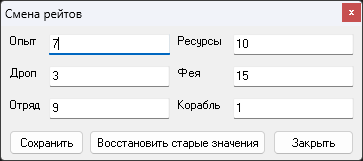

# Программа для смены рейтов сервера

Программа для автоматизированного изменения рейтов сервера. Позволяет редактировать рейты на опыт в одиночку, опыт в отряде, шанс выпадения предметов из монстров, шанс выпадения ресурсов, скорость роста феи и скорость получения опыта кораблем.

**Как пользоваться программой:**

1. Скачайте программу **pkodev.tool.changerates.exe** по ссылке внизу темы;
2. Поместите программу в корневую папку GameServer (рядом с GameServer.exe);
3. Запустите программу. В главном окне должны отобразиться текущие значения рейтов сервера;
4. В соответстсвующие поля введите требуемые значения рейтов:
    * Опыт — Опыт в одиночку;
    * Дроп — Шанс выпадения предметов из монстров;
    * Отряд — Опыт в отряде;
    * Ресурсы — Шанс выпадения ресурсов;
    * Фея — Скорость роста феи;
    * Корабль — Скорость полечения опыта кораблем.
 5. Нажмите кнопку "**Сохранить**";
 6. При необходимости откатить рейты до старых значений, нажмите кнопку "**Восстановить старые значения**";
 7. По завершению работы с программой, нажмите кнопку "**Закрыть**".
 
---

[Скачать (Google Диск)](https://drive.google.com/file/d/1WyNkIiVNBCA9bvL-P6oQElsp2b5DfCgU/view?usp=drive_link)