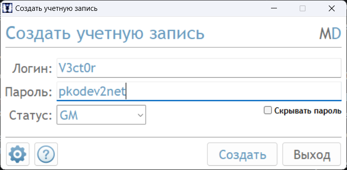
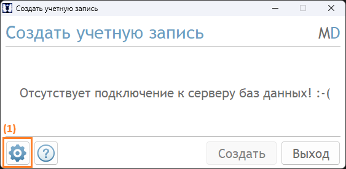
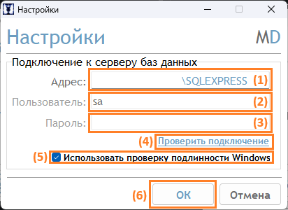
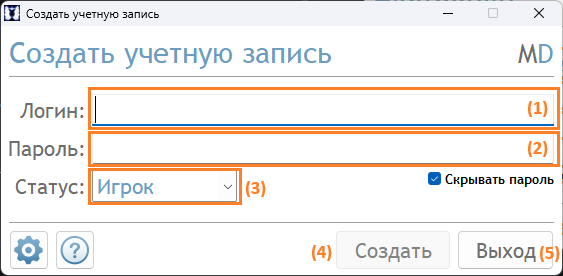

# Программа для создания игровых аккаунтов

Данная программа позволяет быстро создавать учетные записи для игроков и администраторов.

**Как пользоваться программой:**

1. Скачайте программу **Создать учетную запись.exe** по ссылке внизу темы;
2. Поместите программу в любое удобное для вас место и запустите её;
3. Нажмите кнопку "**Настройки**" (**1**) на главной форме приложения:

    

4. Появится окно "**Настройки**". В данном окне заполните следующие поля в зависимости от способа аутентификации:
    * Логин и пароль:
        * "**Адрес**" (**1**) — адрес экземпляра MSSQL Server с базами данных AccountServer и GameDB;
        * "**Пользователь**" (**2**) — учетная запись пользователя MSSQL Server с доступоп к базам даннам AccountServer и GameDB;
        * "**Пароль**" (**3**) — пароль от учетной записи.
    * Проверка подлинности Windows:
        * "**Адрес**" (**1**) — адрес экземпляра MSSQL Server с базами данных AccountServer и GameDB;
        * Поставьте флажок "**Использовать проверку подлинности Windows**" (**5**).

    

5. Нажмите кнопку "**Проверить подключение**" (**4**) — должно появиться сообщение: "**Подключение к серверу баз данных успешно выполнено**". В противном случае исправьте данные для подключения к MSSQL Server и повторно нажмите кнопку. Далее нажмите кнопку "**ОК**" (**6**);
6. Снова появится главная форма приложения, но уже с полями "**Логин**" (**1**), "**Пароль**" (**2**) и "**Статус**" (**3**):
    * В поля "**Логин**" (**1**) и "**Пароль**" (**2**) введите корректные логин и пароль для нового аккаунта;
    * В выпадающем поле "**Статус**" (**3**) выберите тип аккаунта — Игрок или GM.

7. После корректного ввода данных аккаунта кнопка "**Создать**" (**4**) должна стать активной — нажмите её, чтобы создать аккаунт. Должно появиться сообщение: "**Учётная запись [%Логин%] успешно создана!**", либо сообщение с ошибкой в случае, если аккаунт создать не удалось (например, введённый логин уже используется для другого аккаунта);
8. Для выхода из программы нажмите кнопку "**Выход**" (**5**).

---

[Скачать (Google Диск)](https://drive.google.com/file/d/1vhntFJNBPQhrpoO_X8YiP6Kmqb0PCrw8/view?usp=sharing)